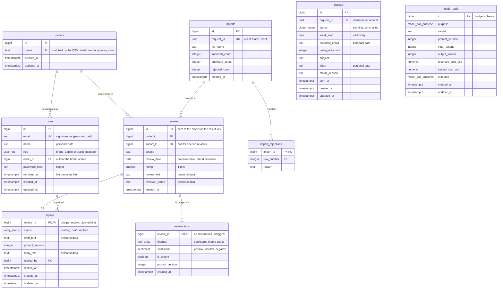

# Entity relationship diagram: Review Intelligence (OutletOwl)

PostgreSQL. 9 tables (8 in `public`, 1 in `budget`), 7 relationships. Written beside [data-model.md](data-model.md) from the same design; the DDL is [schema.sql](schema.sql).

## Diagram

`themes` is `text[]` in the schema; mermaid cannot print brackets in a type, so the diagram writes `text_array`.

## Relationships

| From | | To | Meaning |
| --- | --- | --- | --- |
| outlets | one-to-many | users | An outlet can have several managers and each manager has one outlet; the brand admin has none. An outlet with managers cannot be deleted (RESTRICT). |
| outlets | one-to-many | reviews | Every review belongs to exactly one outlet; an outlet with reviews cannot be deleted (RESTRICT), so no review loses the outlet it is compared under. |
| imports | one-to-many | reviews | An import brings in many reviews; seeded reviews have no import. An import with reviews cannot be deleted (RESTRICT). |
| imports | one-to-many | import_rejections | An import lists each row it rejected; the list belongs to the import and goes with it (CASCADE). |
| reviews | one-to-zero-or-one | review_tags | A review has at most one tag result, and none while untagged; the result follows its review (CASCADE). |
| reviews | one-to-zero-or-one | replies | A review has at most one reply, created when a manager first opens it; the reply follows its review (CASCADE). |
| users | one-to-many | replies | A manager approves many replies; a manager who approved a reply cannot be deleted (RESTRICT), only marked removed, so the reply keeps its approver. |

`model_calls` has no relationship on purpose: it lives in the `budget` schema, which the seed reset never truncates and no Down migration drops, so it must not depend on any domain row (HLD section 4, tenet 2).
