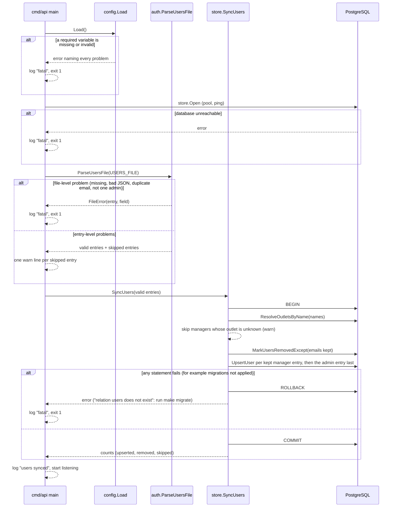
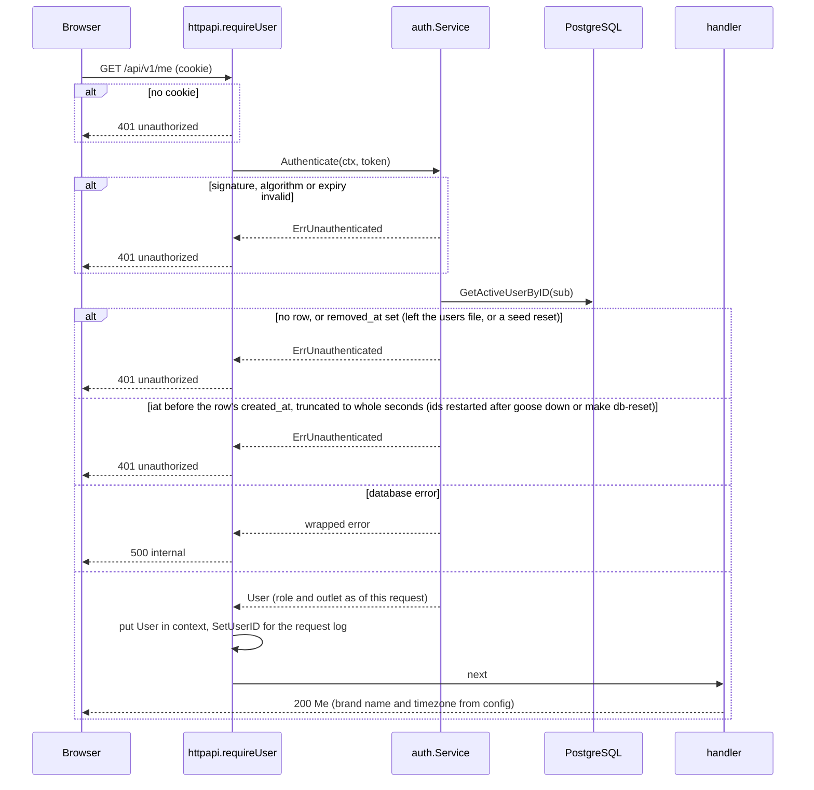

# Low Level Design: API server, build phase 1 (users file, sign-in, outlets)

- Task: none (no task ids yet). HLD: [review-intelligence-hld.md](review-intelligence-hld.md) section 12 phase 1. ADRs: [0001](../adr/0001-use-go-for-the-server.md), [0003](../adr/0003-use-sqlc-pgx-and-goose-for-data-access.md), [0005](../adr/0005-use-rest-with-openapi-for-the-api.md), [0007](../adr/0007-use-jwt-cookies-for-sign-in.md)
- Author: unattributed (no `.bearing/company.json`), 2026-10-07, status Draft
- Version: v2 (2026-10-07): the critic's findings fixed, 415 and cross-origin write protection added (changes table below)
- Version: v2.1 (2026-10-07): the Vite proxy claim corrected after a live run of server work item 5 (section 5); `web/vite.config.ts` now sets `changeOrigin: false`
- Companion: [phase-1-web-lld.md](phase-1-web-lld.md) (the S-01 and S-06 screens that call this server)

Serves: US-01-001, US-00-001 (sign-in part), Q-002, Q-003, ADR-0007, tenets 3, 7 and 8.
Acceptance criteria the tests below prove: AC-US-01-001-1 (the outlet appears in the list; "can be chosen as the outlet of imported reviews" is proven in phase 3, when import exists), AC-US-01-001-2 (refused at the service), AC-US-00-001-1 (sign-in and a refused wrong password; "reach their outlet's dashboard" is proven in phase 4), AC-US-00-001-4 (the scope rule, first applied to outlets here and to reviews in phase 3).

Decisions taken in session for this design (2026-10-07, product owner):

| Point | Decision | Why it was open |
| --- | --- | --- |
| JWT library | `github.com/golang-jwt/jwt/v5`, latest v5 pinned at implementation, HS256 only | ADR-0007 left it "chosen at implementation" |
| Users file format | JSON array, `users.json` | HLD section 17 left the format to this LLD |
| Making a bcrypt hash before the seed exists | `cmd/hashpw`, run as `make hash-password` | The seed writes hashes only from phase 7 |
| Web side | A second LLD on the same branch | The skill writes one LLD per component |
| 415 on login and add-outlet | Documented in `api/openapi.yaml` 1.1.1 | The handlers returned it; the spec did not list it (critic) |
| Cross-site writes | Refuse unsafe methods that `Sec-Fetch-Site` marks cross-origin, with an `Origin` to `Host` fallback; keep the SameSite=Strict cookie and the JSON content type rule | SameSite ignores ports, so a page on another localhost port is same-site (critic) |

Changes from v1 (commit 13182d1), each from the critic review in section 10:

| Section | Change |
| --- | --- |
| 2, 5, 8, 9 | Integration tests run across every package (`-tags=integration ./...`); `storetest` says how it finds the migrations and names its databases |
| 2, 4.7, 5, 6, 8, 9 | New cross-origin write check on `net/http.CrossOriginProtection`, with its fallback and the Vite proxy constraint |
| 3, 8 | A users file hash must have bcrypt cost 12, so a known email and an unknown one take the same time |
| 4.1, 5, 8 | `SyncUsers` upserts managers first and the admin last, so a role swap starts cleanly |
| 4.3, 5, 6, 8 | A token issued before its user row was created is refused (ids restart after `goose down` or `make db-reset`) |
| 5 | Sync queries lowercase inside SQL; `UpsertUser` is `:execrows`; the kept list is never empty |
| 3, 4.2, 4.4, 6 | 415 is in the spec (1.1.1); the 409 name detail is stated in the spec |
| 9 | Work items reordered so each leaves `make check` green; the developer's path to a first sign-in is updated in the item that changes it |
| 10 | The CSRF assumption is replaced by the actual defences |

## 1. Scope

The Go API server's phase 1 slice: it loads the users file at start into `users`, signs people in and out with the JWT cookie, resolves the caller on every request from the user row, and serves `GET /api/v1/me`, `GET /api/v1/outlets` and `POST /api/v1/outlets`. It does not include the web screens (companion LLD), imports, reviews, tags, the model gateway or the seed; `review_count` and `untagged_count` in `OutletSummary` are 0 until the `reviews` table exists in phase 3.

## 2. Module layout

Follows the `bearing-backend:go` layout already in the repository. Line counts are estimates; generated code is counted separately and never reviewed line by line.

| Path | Owns | Est. lines |
| --- | --- | --- |
| `db/migrations/00001_create_outlets_and_users.sql` (new) | `user_role`, `outlets`, `users` and their 3 indexes, copied from `docs/design/schema.sql`; Down drops them | 60 |
| `db/queries/users.sql` (new) | user lookups and the users file upsert statements (section 5) | 50 |
| `db/queries/outlets.sql` (new) | outlet list, create, lookup by name, active managers | 40 |
| `internal/store/*.sql.go` (new, generated by `make sqlc`) | typed queries; never edited by hand | about 300, generated |
| `internal/store/users_sync.go` (new) | `SyncUsers`: the one transaction that applies the users file | 90 |
| `internal/store/storetest/storetest.go` (new, build tag `integration`) | creates a database per test run, runs `goose up`, drops it; refuses the demo database (section 5, Test databases) | 110 |
| `internal/config/config.go` | adds `JWTSecret`, `UsersFile`, `BrandName`, `BrandTimezone` | +50 |
| `internal/auth/password.go` (new) | `CheckPassword`, `HashPassword`, the dummy hash for unknown emails | 60 |
| `internal/auth/token.go` (new) | `Tokens.Issue`, `Tokens.Verify` (HS256, `sub`, `iat`, `exp`) | 80 |
| `internal/auth/usersfile.go` (new) | `ParseUsersFile`: JSON decode, file-level and entry-level validation | 150 |
| `internal/auth/service.go` (new) | `Service.Login`, `Service.Authenticate`, the `User` and `Scope` types | 120 |
| `internal/outlets/service.go` (new) | `Service.List`, `Service.Create`, name rules, domain errors | 130 |
| `internal/httpapi/server.go` | `New` takes a `Deps` struct; registers the 5 new routes; the chain gains the cross-origin check | +45 |
| `internal/httpapi/decode.go` (new) | `decodeJSON`: content type, 64 KiB cap, unknown fields, trailing data | 60 |
| `internal/httpapi/errors.go` (new) | `WriteErrorDetails`, `writeDomainError` (domain error to status and code) | 70 |
| `internal/httpapi/session.go` (new) | cookie read and write, `requireUser` wrapper, user in context | 80 |
| `internal/httpapi/auth_handler.go` (new) | `login`, `logout`, `me` | 120 |
| `internal/httpapi/outlets_handler.go` (new) | `listOutlets`, `createOutlet` | 100 |
| `internal/middleware/requestlog.go` | adds `user_id` to the request line through `SetUserID` | +25 |
| `internal/middleware/crossorigin.go` (new) | `CrossOrigin`: wraps `net/http.CrossOriginProtection` and writes the 403 `cross_site_request` envelope through the deny handler | 40 |
| `cmd/api/main.go` | loads and syncs the users file before listening; wires the services | +40 |
| `cmd/hashpw/main.go` (new) | reads a password from stdin, prints a bcrypt hash at cost 12 | 50 |
| `users.example.json` (new) | the format with placeholder values, like `.env.example` | 20 |
| `Makefile`, `.gitignore`, `.env.example`, `.github/workflows/ci.yml`, `AGENTS.md` | `test-integration` runs `-tags=integration ./...`; `hash-password` target; `users.json` ignored; 4 variables; goose installed in the integration job; the first-run steps | +45 |

No file is expected to pass 400 lines. Test files sit beside the code (`*_test.go`; integration tests carry the `integration` build tag).

New modules: `github.com/golang-jwt/jwt/v5` and `golang.org/x/crypto` (bcrypt), both named by ADR-0007. The cross-origin check uses `net/http.CrossOriginProtection` from the standard library (Go 1.25 and later); the migrations in tests run through the goose binary already installed, so neither adds a module.

## 3. Types and schemas

HTTP shapes are in `api/openapi.yaml` 1.1.1 and are not repeated here: `LoginRequest`, `Me`, `OutletSummary`, `OutletCreate`, `UserRef`, `OutletRef`, `Error`. This phase changes no request or response shape. Version 1.1.1 (this revision) lists 415 on login and add-outlet, adds the 403 `cross_site_request` code on every write, and states that the 409 `outlet_name_taken` detail carries the existing name in `details[0].reason`.

| Type | Package | Holds | Validated once, in |
| --- | --- | --- | --- |
| `auth.User` | `internal/auth` | `ID int64`, `Email`, `Name`, `Role` (`brand_admin` or `outlet_manager`), `Outlet *OutletRef` (nil for the admin), `CreatedAt` (for the token age check, section 4.3) | built only from a row read by `GetActiveUserByID` or `GetActiveUserByEmail` |
| `auth.Scope` | `internal/auth` | `All bool`, `OutletID int64` | `User.Scope()`: `All` for `brand_admin`, else the user's outlet. No other constructor, so a scope never comes from a URL, a claim or the UI (tenet 3) |
| `auth.UsersFileEntry` | `internal/auth` | `Email`, `Name`, `Role`, `Outlet *string`, `PasswordHash` | `ParseUsersFile` |
| `auth.Claims` | `internal/auth` | `sub` (user id as a decimal string), `iat`, `exp` | `Tokens.Verify` |
| `outlets.Summary` | `internal/outlets` | `ID`, `Name`, `Managers []UserRef`, `ReviewCount`, `UntaggedCount`, `CreatedAt` | built by `Service.List` and `Service.Create` |
| login request | `internal/httpapi` | email (trimmed, at most 200 characters, shape `^[^@\s]+@[^@\s]+$`, the same as `chk_users_email_shape`), password (1 to 200 characters, not trimmed) | `auth_handler.go` `login` |
| outlet name | `internal/outlets` | trimmed with `strings.TrimSpace`, 1 to 200 characters counted as runes | `outlets.ValidateName`, called by `Service.Create` |
| configuration | `internal/config` | section 7 | `config.Load` |

**Users file format.** A JSON array; unknown fields are refused. Path from `USERS_FILE` (default `users.json`, relative to the working directory), ignored by git. The seed (phase 7) writes the same format.

```json
[
  { "email": "ritika.rao@example.in", "name": "Ritika Rao", "role": "brand_admin", "outlet": null,
    "password_hash": "$2a$12$..." },
  { "email": "arjun.mehta@example.in", "name": "Arjun Mehta", "role": "outlet_manager", "outlet": "Koramangala",
    "password_hash": "$2a$12$..." }
]
```

Rules, checked by `ParseUsersFile` in this order:

- File-level problems stop the server from starting (the error names the entry number and field, never a password hash): the file is missing or unreadable; it is not a JSON array; an entry has an unknown field; two entries share an email ignoring case; the file does not hold exactly one valid `brand_admin` entry (data model section 5).
- Entry-level problems skip that entry with one warning log line naming the entry number and the field (no email, no hash): email blank, over 200 characters or the wrong shape; name blank or over 200; role not one of the two; a manager without `outlet`; an admin with `outlet`; `password_hash` that `bcrypt.Cost` cannot read, or whose cost is not 12. One cost for every account keeps a wrong password for a known email as slow as the dummy check for an unknown one, so timing does not reveal which emails exist; `cmd/hashpw` and the seed write cost 12.
- A manager whose `outlet` names no existing outlet (ignoring case) is skipped the same way, by `SyncUsers`, because only the database knows the outlets.
- A skipped entry counts as "not in the file", so an account it used to describe is marked removed and cannot sign in (HLD section 7, "those accounts cannot sign in").

First run: the file holds the admin only, because no outlet exists yet. The admin signs in and adds outlets (S-06); the operator then adds manager entries and restarts (HLD section 3).

## 4. Sequence

### 4.1 Start-up: load and sync the users file



### 4.2 Sign in

```mermaid
sequenceDiagram
    participant B as Browser
    participant H as httpapi.login
    participant A as auth.Service
    participant PG as PostgreSQL
    Note over B,H: the cross-origin check (4.7) has already run; a cross-origin write got 403 cross_site_request
    B->>H: POST /api/v1/auth/login {email, password}
    alt Content-Type is not application/json
        H-->>B: 415 unsupported_media_type
    else body unreadable, over 64 KiB, unknown field or trailing data
        H-->>B: 400 malformed_request
    else email or password breaks a rule
        H-->>B: 422 validation_failed, details per field
    end
    H->>A: Login(ctx, email, password)
    A->>PG: GetActiveUserByEmail(lower(email))
    alt no active user (unknown or removed)
        A-->>A: bcrypt compare against the dummy hash (same cost, same time)
        A-->>H: ErrInvalidCredentials
        H-->>B: 401 invalid_credentials (same body as a wrong password)
    else wrong password
        A-->>H: ErrInvalidCredentials
        H-->>B: 401 invalid_credentials
    else database error
        A-->>H: wrapped error
        H-->>B: 500 internal (logged with request_id)
    else match
        A->>A: Tokens.Issue(user.ID, now) exp = now + 8h
        A-->>H: User, token
        H-->>B: 200 Me + Set-Cookie outletowl_session (HttpOnly, SameSite=Strict, Path=/, Max-Age=28800)
    end
```

### 4.3 Any signed-in request (shown for GET /me)



### 4.4 Add an outlet

```mermaid
sequenceDiagram
    participant B as Browser
    participant H as httpapi.createOutlet
    participant O as outlets.Service
    participant PG as PostgreSQL
    Note over B,H: the cross-origin check (4.7) and requireUser (4.3) have run; their 403 and 401 branches apply
    B->>H: POST /api/v1/outlets {name}
    H->>O: CheckCanCreate(user)
    alt caller is an outlet manager
        O-->>H: ErrRoleNotAllowed
        H-->>B: 403 role_not_allowed (body not read)
    end
    H->>H: decodeJSON
    alt 415 or 400 as in 4.2
        H-->>B: 415 unsupported_media_type / 400 malformed_request
    end
    H->>O: Create(ctx, user, name)
    alt name blank after trimming, or over 200 characters
        O-->>H: ValidationError{name, blank | too_long}
        H-->>B: 422 validation_failed
    end
    O->>PG: CreateOutlet(name) ON CONFLICT (lower(name)) DO NOTHING RETURNING
    alt no row returned (the name exists ignoring case)
        O->>PG: GetOutletByName(name)
        O-->>H: NameTakenError{Existing}
        H-->>B: 409 outlet_name_taken, details [{field: name, reason: <existing name>}]
    else database error
        O-->>H: wrapped error
        H-->>B: 500 internal
    else created
        O-->>H: Summary (no managers, counts 0)
        H-->>B: 201 OutletSummary, Location /api/v1/outlets/{id}
    end
```

`CheckCanCreate` runs before `decodeJSON` so a manager gets 403 whatever the body; `Create` checks the role again, so the rule holds for any future caller of the service.

### 4.5 List outlets

```mermaid
sequenceDiagram
    participant B as Browser
    participant H as httpapi.listOutlets
    participant O as outlets.Service
    participant PG as PostgreSQL
    Note over B,H: requireUser has run (4.3); its 401 branches apply
    B->>H: GET /api/v1/outlets
    H->>O: List(ctx, user.Scope())
    O->>PG: ListOutlets(all, outlet_id)
    O->>PG: ListActiveManagers(outlet ids)
    alt database error
        O-->>H: wrapped error
        H-->>B: 500 internal
    else
        O-->>H: []Summary ordered by name ignoring case, then id
        H-->>B: 200 {data}
    end
```

### 4.6 Sign out

```mermaid
sequenceDiagram
    participant B as Browser
    participant H as httpapi.logout
    B->>H: POST /api/v1/auth/logout (cookie or none)
    alt handler panics
        H-->>B: 500 internal (middleware.Recover)
    else
        H-->>B: 204, Set-Cookie outletowl_session=; Max-Age=0
    end
```

Signing out does not invalidate a copied token; it stays valid until `exp` (ADR-0007, accepted). Logout is a write, so the cross-origin check (4.7) applies to it too.

### 4.7 Cross-origin check on every write

Runs in the middleware chain before any handler, for every request under `/api/` (chain, outermost first: request id, panic recovery, request log, cross-origin check, routes). Safe methods pass untouched.

```mermaid
sequenceDiagram
    participant B as Browser or client
    participant C as middleware.CrossOrigin
    participant H as route handler
    B->>C: request
    alt GET, HEAD or OPTIONS
        C->>H: next (never refused)
    else Sec-Fetch-Site is same-origin or none
        C->>H: next
    else Sec-Fetch-Site is same-site or cross-site (another site, or another port on localhost)
        C-->>B: 403 cross_site_request (error envelope, request_id); the handler never runs
    else no Sec-Fetch-Site, Origin present and its host differs from Host
        C-->>B: 403 cross_site_request
    else no Sec-Fetch-Site, Origin matches Host
        C->>H: next
    else neither header (curl, tests, other non-browser clients)
        C->>H: next; the cookie rules and the JSON content type still apply
    end
```

The decisions in this diagram were checked against `net/http.CrossOriginProtection` on Go 1.26.8 with a scratch program on 2026-10-07; section 8 turns each into a test.

## 5. Data access

Migration, in order: `00001_create_outlets_and_users` (expand; data model section 8 row 1). It starts with `SET lock_timeout = '2s'; SET statement_timeout = '60s';`, creates `user_role`, `outlets`, `users`, `uq_outlets_name_lower`, `uq_users_email_lower`, `uq_users_one_brand_admin` and `idx_users_outlet_id` exactly as `docs/design/schema.sql`, and its Down drops `users`, `outlets`, then `user_role`. New empty tables: no lock risk.

| Query (sqlc name) | Shape | Index | Rows |
| --- | --- | --- | --- |
| `GetActiveUserByEmail` | `users u LEFT JOIN outlets o ON o.id = u.outlet_id WHERE lower(u.email) = lower($1) AND u.removed_at IS NULL`, returning `u.created_at` too | `uq_users_email_lower` | 0 or 1 |
| `GetActiveUserByID` | same join and columns, `WHERE u.id = $1 AND u.removed_at IS NULL` | `users_pkey` | 0 or 1, once per signed-in request |
| `ResolveOutletsByName` | `SELECT id, name FROM outlets WHERE lower(name) IN (SELECT lower(n) FROM unnest(sqlc.arg(names)::text[]) AS n)`: lowercased inside SQL, so Go passes the names as written | `uq_outlets_name_lower` | at most the manager count |
| `MarkUsersRemovedExcept` | `UPDATE users SET removed_at = now(), updated_at = now() WHERE removed_at IS NULL AND lower(email) <> ALL (SELECT lower(e) FROM unnest(sqlc.arg(emails)::text[]) AS e)`: lowercased inside SQL; the list is never empty (the file always keeps its one admin, section 3), because `<> ALL` over an empty list is true for every row | known full scan, about 10 rows | at most the user count |
| `UpsertUser` (`:execrows`) | `INSERT ... ON CONFLICT (lower(email)) DO UPDATE SET name, role, outlet_id, password_hash, removed_at = NULL, updated_at = now() WHERE (users.name, users.role, users.outlet_id, users.password_hash, users.removed_at) IS DISTINCT FROM (EXCLUDED.name, EXCLUDED.role, EXCLUDED.outlet_id, EXCLUDED.password_hash, NULL)`; returns the rows changed, 0 when nothing differs, never an error for "no rows" | `uq_users_email_lower` | 0 or 1 |
| `ListOutlets` | `SELECT id, name, created_at FROM outlets WHERE (sqlc.arg(all_outlets)::boolean OR id = sqlc.arg(outlet_id)) ORDER BY lower(name), id` | known full scan, at most 25 rows (data model: 10^1) | the caller's outlets |
| `ListActiveManagers` | `SELECT id, name, outlet_id FROM users WHERE outlet_id = ANY($1::bigint[]) AND role = 'outlet_manager' AND removed_at IS NULL ORDER BY lower(name), id` | `idx_users_outlet_id` | about 1 per outlet |
| `CreateOutlet` | `INSERT INTO outlets (name) VALUES ($1) ON CONFLICT (lower(name)) DO NOTHING RETURNING id, name, created_at` | `uq_outlets_name_lower` | 0 or 1 |
| `GetOutletByName` | `SELECT id, name, created_at FROM outlets WHERE lower(name) = lower($1)` | `uq_outlets_name_lower` | 1 after a conflict |

The scope condition is an explicit boolean plus an id, never "null means all", so a manager row with a missing outlet cannot widen to every outlet (the database also refuses that row: `chk_users_role_outlet`).

Transactions:

- `SyncUsers`: one transaction holding `ResolveOutletsByName`, `MarkUsersRemovedExcept` and every `UpsertUser`. Removing first, then upserting the manager entries, then the admin entry last, means neither an admin email change nor a role swap (the admin becomes a manager and a manager becomes the admin) ever has two active admins at once, so `uq_users_one_brand_admin` never refuses a valid file (data model section 5). Outside it: reading and parsing the file, which needs no database. A failure rolls back, so the table is never half-applied.
- `CreateOutlet`: one statement, no explicit transaction. The follow-up `GetOutletByName` after a conflict runs outside it; the row it reads is committed (it caused the conflict) and no path deletes outlets, so it is always found.
- Sign-in and request authentication: one read each, no transaction.

Before work item 6 writes the queries, `make sqlc` is run on the two `ON CONFLICT (lower(...))` statements alone: PostgreSQL accepts them, sqlc v1.31.1 is unverified. If sqlc refuses them, the fallback is an `UPDATE ... WHERE lower(email) = lower($1)` then an `INSERT` when it touched no row, inside the same transaction, which the unique index still guards.

Test databases (`storetest`): `make test-integration` runs `go test -race -count=1 -tags=integration ./...` with `DATABASE_URL` pointing at the local PostgreSQL. Each test package that calls `storetest.New(t)` gets its own database named `outlet_owl_test_<pid>_<8 random hex>`, so packages running in parallel never share one. `storetest` connects with `DATABASE_URL`, runs `CREATE DATABASE`, then runs the goose binary (`goose -dir <repo>/db/migrations postgres <url> up`, where `<repo>` is found from `storetest`'s own source path with `runtime.Caller`), and drops the database with `DROP DATABASE ... WITH (FORCE)` in `t.Cleanup`. It fails the test before any statement when `current_database()` on the returned pool is `outlet_owl`. It returns a `*pgxpool.Pool` and the URL, never a `*store.Store`, so tests inside package `store` can use it without an import cycle. CI's integration job installs goose v3.28.0 with `go install`.

Cross-origin writes and the React-to-Go setup: the check (section 4.7) needs no configuration and no trusted origins, because every approved way of running the UI is same-origin.

- Built UI served by the Go binary (ADR-0002): the page and the API share `http://localhost:8080`; the browser sends `Sec-Fetch-Site: same-origin`.
- Development (`make web-dev`): the page is on `http://localhost:5173` and calls `/api` there; the browser sends `Sec-Fetch-Site: same-origin` and `Origin: http://localhost:5173`. The Vite proxy (`web/vite.config.ts`) forwards both, and with `changeOrigin: false` it keeps `Host: localhost:5173`, so both the header check and the `Origin` to `Host` fallback pass. Vite's string shorthand (`"/api": "http://localhost:8080"`) turns `changeOrigin` on and rewrites `Host` to `localhost:8080`; a live run on 2026-10-07 showed that a write from a browser without `Sec-Fetch-Site` then gets 403. The config therefore uses the object form with `changeOrigin: false` (server work item 5), and the web LLD's proxy test pins it.
- A page on any other local port (`localhost:3000`) is `same-site` to the browser, which SameSite=Strict allows; the check refuses it.

The existing protections stay: the cookie is HttpOnly and SameSite=Strict, and every JSON write requires `Content-Type: application/json` (415 otherwise), which a cross-site form cannot send without a CORS preflight that the server never answers with permission. From phase 3, `POST /imports` takes `multipart/form-data`; its required `Idempotency-Key` header also forces a preflight, so it keeps two defences.

Jobs and workers: none in this phase. `SyncUsers` runs once per process start. Two servers started at once against one database each run it; the second waits on the first's row locks and then applies the same file, which changes nothing (`IS DISTINCT FROM`). One server per installation is the HLD's deployment (section 3).

## 6. Errors

All HTTP errors use the envelope in `api/openapi.yaml` (`Error`), written only by `httpapi.WriteError` or `WriteErrorDetails`, with `request_id` from `middleware.RequestID`.

| Error | Created in | Wrapped in | Mapped in | Status, code |
| --- | --- | --- | --- | --- |
| `auth.ErrInvalidCredentials` | `auth/service.go` `Login` | not wrapped | `httpapi/auth_handler.go` | 401 `invalid_credentials` |
| `auth.ErrUnauthenticated` | `auth/token.go` `Verify`; `auth/service.go` `Authenticate` (no active row, or a token issued before the row was created) | `Authenticate` wraps the token cause with `%w`; the cause is logged at debug, never returned | `httpapi/session.go` `requireUser` | 401 `unauthorized` |
| `outlets.ErrRoleNotAllowed` | `outlets/service.go` `CheckCanCreate` | not wrapped | `httpapi/errors.go` `writeDomainError` | 403 `role_not_allowed` |
| `outlets.ValidationError{Field, Reason}` | `outlets/service.go` `ValidateName` | not wrapped | `writeDomainError` | 422 `validation_failed`, details `[{field, reason}]`, reason `blank` or `too_long` |
| `outlets.NameTakenError{Existing}` | `outlets/service.go` `Create` | not wrapped | `writeDomainError` | 409 `outlet_name_taken`, details `[{field: name, reason: <existing name>}]` |
| login field rules | `httpapi/auth_handler.go` | n/a | same file | 422 `validation_failed`, reason `blank`, `too_long` or `invalid_email` |
| `errUnsupportedMediaType` | `httpapi/decode.go` | n/a | `decodeJSON` callers | 415 `unsupported_media_type` |
| `errMalformed` | `httpapi/decode.go` (JSON syntax, wrong type, unknown field, over 64 KiB, trailing data) | n/a | `decodeJSON` callers | 400 `malformed_request` |
| store errors (pgx) | `internal/store` | `fmt.Errorf("<operation>: %w", err)` in the service | `writeDomainError` default branch: logs the error with `request_id`, writes 500 | 500 `internal` |
| `auth.FileError{Entry, Field, Reason}` | `auth/usersfile.go` | `fmt.Errorf("users file %s: %w", path, err)` in `main` | `cmd/api/main.go`: log `fatal`, exit 1 | process does not start |
| `auth.EntryProblem{Entry, Field, Reason}` | `auth/usersfile.go`; `store/users_sync.go` for an unknown outlet | not an error: returned in a list | `main` logs one warn line each | entry skipped |
| cross-origin refusal | `net/http.CrossOriginProtection.Check` | not wrapped; its reason is logged at info with `request_id` | `middleware/crossorigin.go` deny handler, through `httpapi.WriteError` | 403 `cross_site_request` |
| panic | anywhere in a handler | n/a | `middleware.Recover` (exists) | 500 `internal` |

A request that reaches no route under `/api/` keeps the existing 404 `not_found`. Every 500 message is the fixed text from the spec; no internal detail reaches the client.

## 7. Configuration

| Variable | Default | When missing or invalid | In `.env.example` |
| --- | --- | --- | --- |
| `DATABASE_URL` | none | refuse to start (exists) | yes |
| `PORT` | `8080` | default applies (exists) | yes |
| `LOG_LEVEL` | `info` | an unknown level refuses to start (exists) | yes |
| `JWT_SECRET` | none | refuse to start; also refused when shorter than 32 bytes. Changing it signs everyone out (HLD section 7) | missing: only a commented line today |
| `USERS_FILE` | `users.json` | the file must exist: refuse to start when it does not (section 3) | missing |
| `BRAND_NAME` | none | refuse to start; shown in `Me.brand.name` | missing |
| `BRAND_TIMEZONE` | `Asia/Kolkata` | refuse to start unless `time.LoadLocation` accepts it; `cmd/api` imports `time/tzdata` so the zone database ships in the binary | missing |

Missing from `.env.example`: 4 (`JWT_SECRET`, `USERS_FILE`, `BRAND_NAME`, `BRAND_TIMEZONE`). Work item 2 adds them: `JWT_SECRET=` empty with the comment "generate one: `openssl rand -hex 32`", `USERS_FILE=users.json`, `BRAND_NAME=Neem Tree Kitchens` (the demo brand in the API examples), `BRAND_TIMEZONE=Asia/Kolkata`.

Fixed in code, not configuration: the 8 hour token and cookie lifetime (HLD design choice 4), the cookie name `outletowl_session` and its attributes (the spec), bcrypt cost 12 for `cmd/hashpw`.

## 8. Tests

Unit tests run in `make check` (`go-test`); integration tests (`-tags=integration`, in every package) run in `make test-integration` and the CI `integration` job, each on a database `storetest` creates for that run and drops after it. `storetest` fails the test when `current_database()` is `outlet_owl`, the demo database (data model section 12).

Configuration and tooling:

- `TestLoad_RequiresJWTSecretOfAtLeast32Bytes` (unit)
- `TestLoad_RequiresBrandName` (unit)
- `TestLoad_DefaultsUsersFileAndTimezone` (unit)
- `TestLoad_RejectsUnknownTimezone` (unit)
- `TestHashpw_PrintsHashThatChecksAgainstInput` (unit, `cmd/hashpw`)
- `TestHashpw_RefusesPasswordOver72Bytes` (unit)
- `TestMigration00001_UpDownUp` (integration): goose up, down, up on a fresh database.
- `TestStoretest_RefusesDemoDatabase` (integration)
- `TestStoretest_ParallelPackagesGetSeparateDatabases` (integration): two calls get two names.

Passwords and tokens (`internal/auth`):

- `TestCheckPassword_MatchesHash`, `TestCheckPassword_WrongPasswordFails` (unit)
- `TestDummyHash_HasCost12` (unit): the unknown-email path costs the same as a real check, given the cost 12 rule below.
- `TestTokens_IssueVerifyRoundTrip` (unit)
- `TestTokens_ExpiredAfter8Hours` (unit, injected clock): valid at 7h59m, refused at 8h.
- `TestTokens_RejectsAlgNone`, `TestTokens_RejectsHS512` (unit)
- `TestTokens_RejectsTamperedSignature`, `TestTokens_RejectsOtherSecret`, `TestTokens_RequiresExp` (unit)

Users file:

- `TestParseUsersFile_ValidFile` (unit)
- `TestParseUsersFile_MissingFileIsFileError` (unit)
- `TestParseUsersFile_UnknownFieldIsFileError` (unit)
- `TestParseUsersFile_DuplicateEmailIgnoringCaseIsFileError` (unit)
- `TestParseUsersFile_NoAdminIsFileError`, `TestParseUsersFile_TwoAdminsIsFileError` (unit)
- `TestParseUsersFile_AdminWithOutletLeavesNoAdmin` (unit)
- `TestParseUsersFile_ManagerWithoutOutletIsSkipped` (unit)
- `TestParseUsersFile_CostOtherThan12IsSkipped` (unit)
- `TestParseUsersFile_UnreadableHashIsSkipped`, `TestParseUsersFile_BadEmailShapeIsSkipped`, `TestParseUsersFile_BlankNameIsSkipped` (unit)
- `TestParseUsersFile_ErrorsNeverContainHash` (unit)
- `TestSyncUsers_InsertsThenUpdatesChangedFields` (integration)
- `TestSyncUsers_RepeatChangesNothing` (integration): `updated_at` unchanged on the second run.
- `TestSyncUsers_MarksMissingEmailRemoved` (integration)
- `TestSyncUsers_ReturningEmailIsRestored` (integration)
- `TestSyncUsers_UnknownOutletSkipsEntryAndRemovesAccount` (integration)
- `TestSyncUsers_AdminEmailChangeKeepsOneActiveAdmin` (integration)
- `TestSyncUsers_AdminAndManagerSwapRoles` (integration): starts cleanly with one active admin.
- `TestSyncUsers_MixedCaseEmailIsNotRemovedAndRestored` (integration): `updated_at` unchanged on a repeat.
- `TestSyncUsers_RollsBackOnFailure` (integration): a cancelled context mid-sync leaves the previous rows.

Sign-in and session (`internal/auth` with a fake store, `internal/httpapi` with `httptest`):

- `TestLogin_Succeeds` (unit), proves AC-US-00-001-1.
- `TestLogin_WrongPasswordIsInvalidCredentials` (unit), proves AC-US-00-001-1.
- `TestLogin_UnknownAndRemovedEmailGetSameError` (unit)
- `TestLogin_EmailMatchesIgnoringCase` (integration)
- `TestAuthenticate_RereadsRoleAndOutletEachRequest` (integration): the users file moves a manager to another outlet; the same token now sees the new outlet (tenet 3, ADR-0007).
- `TestAuthenticate_RemovedUserIsUnauthenticated` (integration)
- `TestAuthenticate_TokenOlderThanUserRowIsRefused` (integration): issue a token, drop and recreate the tables, recreate a user with the same id; the old token gets 401.
- `TestLoginHandler_SetsHttpOnlyStrictCookie` (unit): name, `HttpOnly`, `SameSite=Strict`, `Path=/`, `Max-Age=28800`.
- `TestLoginHandler_WrongPasswordReturns401InvalidCredentials` (unit), proves AC-US-00-001-1.
- `TestLoginHandler_BlankEmailReturns422` (unit)
- `TestLoginHandler_UnknownFieldReturns400` (unit)
- `TestLoginHandler_TextPlainReturns415` (unit)
- `TestLogoutHandler_ClearsCookieWithoutSession` (unit)
- `TestMeHandler_NoCookieReturns401` (unit)
- `TestMeHandler_ExpiredCookieReturns401` (unit)
- `TestMeHandler_ReturnsBrandAndOutlet` (unit)
- `TestRequestLog_IncludesUserID` (unit)
- `TestCreateOutletHandler_TextPlainReturns415` (unit)

HTTP plumbing (`internal/httpapi`, unit):

- `TestDecodeJSON_RejectsWrongContentType`, `TestDecodeJSON_RejectsUnknownField`, `TestDecodeJSON_RejectsOver64KiB`, `TestDecodeJSON_RejectsTrailingData`
- `TestWriteDomainError_MapsEachDomainError`: every row of section 6 to its status and code.
- `TestWriteDomainError_UnknownErrorIs500WithoutDetail`

Cross-origin writes (`internal/middleware`, unit, one per branch of section 4.7):

- `TestCrossOrigin_SameOriginPostAllowed`
- `TestCrossOrigin_ViteProxyRequestAllowed`: `Sec-Fetch-Site: same-origin`, `Origin: http://localhost:5173`, `Host: localhost:5173`.
- `TestCrossOrigin_ViteProxyWithoutFetchSiteAllowed`: the same without `Sec-Fetch-Site` (the fallback).
- `TestCrossOrigin_UserInitiatedNoneAllowed`
- `TestCrossOrigin_OtherLocalPortRefused`: `Sec-Fetch-Site: same-site`, `Origin: http://localhost:3000`.
- `TestCrossOrigin_CrossSiteRefused`
- `TestCrossOrigin_MissingFetchSiteMismatchedOriginRefused`
- `TestCrossOrigin_NoHeadersAllowed` (curl and tests)
- `TestCrossOrigin_SafeMethodsNeverRefused` (GET, HEAD, OPTIONS with `cross-site`)
- `TestCrossOrigin_RefusalUsesErrorEnvelope`: 403, code `cross_site_request`, the request id, and the handler never ran.
- `TestCrossOrigin_LoginAndLogoutAreProtected` (`internal/httpapi`, through `New`)

Outlets:

- `TestCreate_ManagerRefused` (unit), proves AC-US-01-001-2 at the service.
- `TestValidateName_TrimsAndCountsRunes` (unit): 200 Devanagari characters pass, 201 fail.
- `TestValidateName_BlankAfterTrimIsRejected` (unit)
- `TestCreateOutletHandler_AdminGets201WithLocation` (unit), proves AC-US-01-001-1.
- `TestCreateOutletHandler_ManagerGets403BeforeBodyIsRead` (unit), proves AC-US-01-001-2.
- `TestCreateOutletHandler_DuplicateGets409WithExistingName` (unit)
- `TestCreateOutlet_UniqueIgnoringCase` (integration): "koramangala" after "Koramangala" returns the stored name.
- `TestCreateThenListOutlets_NewOutletAppears` (integration), proves AC-US-01-001-1.
- `TestListOutlets_ManagerSeesOnlyOwnOutlet` (integration), proves the scope rule behind AC-US-00-001-4.
- `TestListOutlets_AdminSeesAllOrderedByName` (integration)
- `TestListOutlets_ManagersExcludeRemovedUsers` (integration)
- `TestListOutlets_NewOutletHasNoManagers` (integration): the S-06 partial state's data.

Nothing in this phase retries, falls back or rate-limits, so no retry-pair tests are needed.

## 9. Work breakdown

Each item is one commit on its own branch, leaves `make check` green, and keeps `make test-integration` green. The items that add a dependency say so. An item that changes how the server starts also updates the first-run steps in `AGENTS.md`, so a developer can run `make dev` after every item.

1. **Migration 00001 and the per-run test databases.** `db/migrations/00001_create_outlets_and_users.sql`, `internal/store/storetest/storetest.go`, the `Makefile` `test-integration` target (`-tags=integration ./...`), the CI integration job installing goose v3.28.0. Tests: `TestMigration00001_UpDownUp`, `TestStoretest_RefusesDemoDatabase`, `TestStoretest_ParallelPackagesGetSeparateDatabases`. About 260 lines.
2. **Configuration.** `internal/config/config.go`, `config_test.go`, `.env.example`, `cmd/api/main.go` (`time/tzdata`), `AGENTS.md` first-run steps (copy the new variables into `.env`, generate `JWT_SECRET`). The 4 config tests. About 140 lines.
3. **Passwords, tokens and `cmd/hashpw`.** Adds `golang-jwt/jwt/v5` and `golang.org/x/crypto`. `internal/auth/password.go`, `token.go`, their tests, `cmd/hashpw/main.go` and its tests, `make hash-password`. About 330 lines.
4. **Users file parsing.** `internal/auth/usersfile.go` with the cost 12 rule, its tests, `users.example.json`, `users.json` in `.gitignore`. About 340 lines.
5. **Cross-origin write check.** `internal/middleware/crossorigin.go`, its tests, the chain in `internal/httpapi/server.go` (the existing `New` signature; only the chain changes), and `web/vite.config.ts` set to `changeOrigin: false` (section 5). The spec already says 1.1.1. About 180 lines.
6. **Queries and the users sync, wired at start.** First `make sqlc` on the two `ON CONFLICT (lower(...))` statements (section 5). `db/queries/users.sql`, `db/queries/outlets.sql`, generated `internal/store/*.sql.go`, `internal/store/users_sync.go`, the `TestSyncUsers_*` tests, `cmd/api/main.go` (parse, sync, log, refuse to start), `AGENTS.md` first-run steps (copy `users.example.json`, `make hash-password`, `make migrate`). About 310 hand-written lines plus generated code.
7. **Sign-in service.** `internal/auth/service.go` (`Service`, `User`, `Scope`, the token age check), the `TestLogin_*` and `TestAuthenticate_*` tests (unit with a fake store, integration with `storetest`). Exported, no HTTP yet. About 260 lines.
8. **HTTP plumbing.** `httpapi.New` takes `Deps`, updated together with `cmd/api/main.go` and `server_test.go`; `internal/httpapi/decode.go` and `errors.go` with their unit tests; `SetUserID` in `requestlog.go`. About 300 lines.
9. **Login, logout and me.** `internal/httpapi/session.go`, `auth_handler.go`, the routes, the handler tests, `TestRequestLog_IncludesUserID`, `TestCrossOrigin_LoginAndLogoutAreProtected`. About 340 lines.
10. **Outlets.** `internal/outlets/service.go`, `internal/httpapi/outlets_handler.go`, the routes, the outlet unit and integration tests. About 380 lines.

Order check: item 1 creates the tables that 6 queries; 2 defines the config that 7 and 9 read; 3 defines `Tokens` and `CheckPassword` used by 7; 4 defines `UsersFileEntry` used by 6; 5 needs only the existing chain; 6 defines the queries used by 7 and 10; 7 defines `User`, `Scope` and `Service` used by 9 and 10; 8 defines `Deps`, `decodeJSON` and `writeDomainError` used by 9 and 10, and updates every caller of `New` in the same item; 9 defines `requireUser` used by 10. No item leaves an unexported helper without a caller or a test. Largest item: about 380 lines.

## 10. Assumptions

- assumption: one server process runs per installation, so the start-up sync never races another writer except a second accidental start, which applies the same file (HLD section 3). Breaks if two servers with different users files share a database. Owner: product owner.
- assumption: browsers keep a cookie without `Secure` on `http://localhost`, as the spec's cookie attributes require; the product runs only on localhost (PRD section 6). Confirm on the first manual sign-in in Chrome, Firefox and Safari. Owner: developer, work item 9.
- assumption: bcrypt cost 12 takes about 250 ms per check on a laptop, which bounds password guessing to a few per second per connection; the spec has no rate limit ("No rate limiting"). Confirm with a benchmark in work item 3. Owner: developer.
- assumption: no CSRF token is needed, because three defences cover every write: the cross-origin check (section 4.7; every browser since 2023 sends `Sec-Fetch-Site`), the `application/json` requirement (a cross-site form cannot send it without a preflight the server never grants), and the SameSite=Strict cookie (which stops other sites but not other ports on localhost, hence the first). A browser older than 2020 that sends neither `Sec-Fetch-Site` nor `Origin` gets only the last two. Breaks if a write accepts a form content type without a required custom header. Owner: developer, every later phase (phase 3 import keeps `Idempotency-Key` required).
- The existing name in `details[0].reason` for `outlet_name_taken` is now stated in the spec (1.1.1), so it is no longer an assumption.
- assumption: `Location: /api/v1/outlets/{id}` is acceptable although the spec defines no `GET /outlets/{id}`; the header is optional in the spec. Owner: product owner (see Noticed in the report).

### Critic review, 2026-10-07

Reviewed by: critic (graded mode), 2026-10-07, both phase 1 LLDs. Verdict: approve after fixing "Integration tests outside internal/store never run", "Two work items leave make check red" and "A role swap in the users file stops the server from starting"; the other MINORs can go in the same revision. v2 (2026-10-07) fixes every finding; the Status column says where.

Weakest claims:

1. s5 "removing first, then upserting, means changing the admin's email never trips `uq_users_one_brand_admin`": a role swap (a@ admin to manager, b@ manager to admin) marks nobody removed, so upserting b@ first gives two active admins and the sync rolls back. Falsify: five statements in psql on a scratch database from schema.sql.
2. s8 `TestDummyHash_HasCost12` "the unknown-email path costs the same as a real check": only when every hash in the file has cost 12; s3 accepts any cost `bcrypt.Cost` can read, so a cost 10 hash answers faster and reveals which emails exist. Falsify: time 20 logins each for a known and an unknown email.
3. s8 integration tests in `internal/auth` and `internal/outlets` "prove" AC-US-01-001-1, tenet 3 and the scope rule: `make test-integration` runs only `./internal/store/...` (Makefile line 83), so they never run.

Not said (v2 answers each except the first, which is HLD phase 0 work outside this LLD): the server serving `web/dist` with an index.html fallback for client routes (HLD phase 0); how `storetest` runs goose (binary path to `db/migrations`, or the goose library as an unlisted module), unique database names under parallel packages, and the import cycle inside package `store`; the developer's path from clone to first sign-in between items 2 and 8; whether eslint-plugin-react-hooks 7 compiler rules flag fetch-on-mount state; whether sqlc v1.31.1 accepts the two `ON CONFLICT (lower(...))` statements (PostgreSQL does).

Findings:

| Grade | Finding | Fix proposed by the critic | Status |
| --- | --- | --- | --- |
| MAJOR | Integration tests outside `internal/store` never run | Item 1 changes `test-integration` to `-tags=integration ./...`; s2 says how `storetest` finds the migrations and names its databases | fixed (s2, s5 Test databases, s8, s9 item 1) |
| MINOR | A role swap in the users file stops the server from starting | `SyncUsers` upserts non-admin entries first and the admin last; add `TestSyncUsers_AdminAndManagerSwapRoles` | fixed (s4.1, s5 Transactions, s8 `TestSyncUsers_AdminAndManagerSwapRoles`) |
| MINOR | Items 6 (server) and W2 (web) leave `make check` red: `New(Deps)` without its callers, unused helpers, `useSession` exported beside components | Move decode, errors, session and `Deps` into item 7 with `main.go`; put the context and `useSession` in `app/session-context.ts` | fixed (s9 items 7 to 9; web LLD s2 `session-context.ts`) |
| MINOR | Sign-in timing depends on a hash cost nobody enforces | Skip entries whose cost is not 12; add `TestParseUsersFile_CostOtherThan12IsSkipped` | fixed (s3 cost 12 rule, s8 `TestParseUsersFile_CostOtherThan12IsSkipped`) |
| MINOR | After `goose down`/`up` or `make db-reset`, an old token's `sub` can name a different user | `Authenticate` refuses a token whose `iat` is before the row's `created_at`; add `TestAuthenticate_TokenOlderThanUserRowIsRefused` | fixed (s4.3, s5, s6, s8 `TestAuthenticate_TokenOlderThanUserRowIsRefused`) |
| MINOR | The CSRF assumption rests on SameSite, which ignores ports; the real defence is the JSON content type forcing a preflight | Rewrite the assumption; the critic proposes a `Sec-Fetch-Site` check on unsafe methods (a new middleware, needs the product owner's yes) | fixed: the product owner approved the check on 2026-10-07 (s4.7, s5, s6, s8; spec 1.1.1); assumption rewritten (s10) |
| MINOR | 415 is returned by `login` and `createOutlet` but neither lists it in the spec | openapi 1.1.1 adds 415 to both (a spec change, needs the product owner's yes) | fixed: spec 1.1.1, approved by the product owner on 2026-10-07 |
| MINOR | Sync queries rely on Go lowercasing arrays; `<> ALL('{}')` removes everyone; `UpsertUser :one` returns no rows when nothing changed | Lowercase inside SQL, `UpsertUser` as `:execrows`, state the kept list is never empty | fixed (s5 query table) |
| MINOR | Web: the first visit with no cookie shows the "session ended" notice | `SessionProvider` ignores the unauthorized handler while loading; add a test | fixed (web LLD s4.1, s6, s8) |
| MINOR | Web: an outlet added while the list loads can vanish when the older list arrives | Refetch after 201 (or merge by id); take the order from the server | fixed (web LLD s4.4, s8) |
| NIT | The 409 puts a name in `details[].reason`, which elsewhere holds codes | State it in the spec, or use reason `taken` and the name in `message` | fixed: stated in the spec's `createOutlet` description (1.1.1) |
