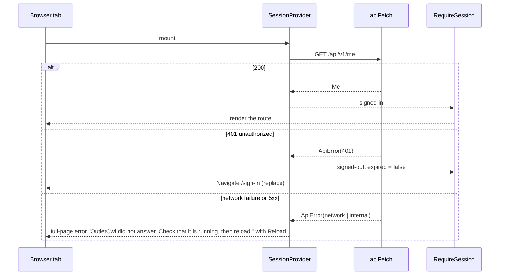
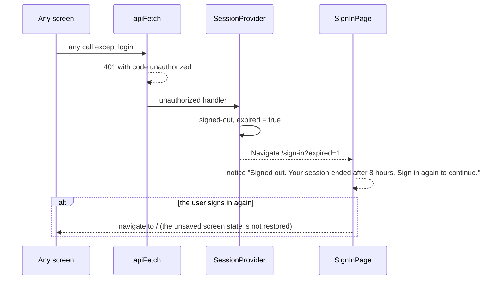
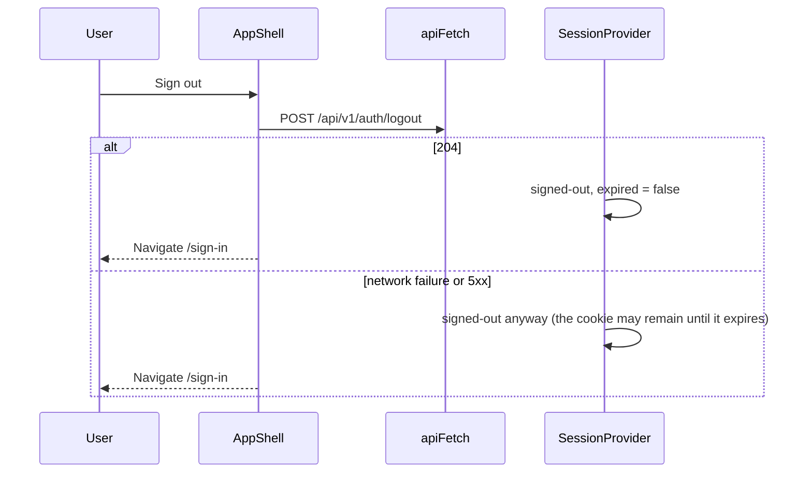

# Low Level Design: web UI, build phase 1 (sign-in, app shell, outlets)

- Task: none (no task ids yet). HLD: [review-intelligence-hld.md](review-intelligence-hld.md) section 12 phase 1. ADRs: [0002](../adr/0002-use-react-and-vite-for-the-ui.md), [0005](../adr/0005-use-rest-with-openapi-for-the-api.md), [0007](../adr/0007-use-jwt-cookies-for-sign-in.md)
- Author: unattributed (no `.bearing/company.json`), 2026-10-07, status Draft
- Companion: [phase-1-server-lld.md](phase-1-server-lld.md) (the endpoints these screens call)
- Screens: [S-01 Sign in](screens/app/S-01-sign-in.html), [S-06 Outlets](screens/app/S-06-outlets.html); navigation from `docs/design/design.json` (`navigation`)

Serves: US-01-001, US-00-001 (sign-in part), Q-002, Q-003, ADR-0007, tenets 6 and 7.
Acceptance criteria the tests below prove: AC-US-01-001-1 (an added outlet appears in the list), AC-US-01-001-2 (refused on screen: a manager never sees the add form or the Outlets entry), AC-US-00-001-1 (sign-in and a refused wrong password; the dashboard itself arrives in phase 4).

Decisions taken in session for this design (2026-10-07, product owner). ADR-0002 left these to design:

| Point | Decision | Adds |
| --- | --- | --- |
| Routing | `react-router` v7, declarative (library) mode | 1 dependency |
| API types (tenet 7) | `openapi-typescript`, output committed, a gate fails when it is stale | 1 dev dependency |
| Server data | plain `fetch` through one client, React state per screen; caching revisited in phase 4 | nothing |
| Brand name on S-01 | dropped: S-01 says "Sign in to review intelligence"; the brand appears in the top bar from `GET /me` | nothing; recorded as a deviation from the mockup |

Also decided here, with no new dependency: styles are plain CSS (the design tokens plus a port of the mockup classes the two screens use); fonts fall back to `system-ui` from the token stacks until a phase that shows review text bundles Plus Jakarta Sans and Noto Sans Devanagari (HLD section 3: fonts ship in the build, never from a CDN).

## 1. Scope

The React app's phase 1 slice: the API client and generated types, the session (who is signed in, from `GET /me`), the router with a signed-in guard, the app shell (top bar and side nav), the S-01 sign-in screen and the S-06 outlets screen for the brand admin. It does not include the overview, reviews, themes, import or digest screens; `/` shows a placeholder until phase 4 builds S-02, and the Go server serving the built files is outside this slice (see the report's Noticed).

## 2. Module layout

Follows the `bearing-apps:react` layout without the parts this repository has not chosen (no Zod, TanStack Query or shadcn). Line counts are estimates.

| Path | Owns | Est. lines |
| --- | --- | --- |
| `web/src/main.tsx` | mount; imports the two style files | +2 |
| `web/src/App.tsx`, `web/src/App.test.tsx` | removed: replaced by `src/app/` | -30 |
| `web/src/app/App.tsx` (new) | `BrowserRouter`, `SessionProvider`, `AppRoutes` | 20 |
| `web/src/app/routes.tsx` (new) | the route table (section 3) | 40 |
| `web/src/app/session.tsx` (new) | `SessionProvider`, `useSession`, `RequireSession`, `RequireRole` | 120 |
| `web/src/components/AppShell.tsx` (new) | top bar (product, brand, person and role, Sign out), side nav from the role, `<Outlet />` | 90 |
| `web/src/components/OverviewPlaceholder.tsx` (new) | `/` until phase 4: "The overview arrives with the dashboard." plus the caller's outlet for a manager | 20 |
| `web/src/features/auth/api.ts` (new) | `login`, `logout`, `getMe` | 30 |
| `web/src/features/auth/SignInPage.tsx` (new) | S-01, four states | 120 |
| `web/src/features/outlets/api.ts` (new) | `listOutlets`, `createOutlet` | 25 |
| `web/src/features/outlets/OutletsPage.tsx` (new) | S-06 page: load state, count, layout | 90 |
| `web/src/features/outlets/OutletTable.tsx` (new) | the outlet table, the no-manager badge | 60 |
| `web/src/features/outlets/AddOutletForm.tsx` (new) | the add form, field errors | 100 |
| `web/src/lib/api.ts` (new) | `apiFetch`, `ApiError`, `setUnauthorizedHandler` | 90 |
| `web/src/lib/api-types.ts` (new, generated) | `paths` and `components` from `api/openapi.yaml`; never edited by hand | about 900, generated |
| `web/src/styles/tokens.css` (new) | a copy of `docs/design/tokens.css`; its first comment names the source | 131, copied |
| `web/src/styles/app.css` (new) | the classes S-01, S-06 and the shell use, ported from `docs/design/screens/app/screens.css` | 220 |
| `web/package.json`, `pnpm-lock.yaml` | `react-router` (dependency), `openapi-typescript` (dev dependency), script `api-types` | +5 |
| `Makefile` | `web-api-types` (writes the file) and `web-api-types-check` (a gate, added to `GATES`) | +12 |
| `web/vite.config.ts` | unchanged: `/api` is already forwarded to :8080 | 0 |

No hand-written file is expected to pass 400 lines. Tests sit beside the code as `*.test.tsx`.

## 3. Types and schemas

Every API shape comes from `web/src/lib/api-types.ts`, generated from `api/openapi.yaml` by `openapi-typescript` and formatted by Prettier. Feature files name what they use, for example `type Me = components["schemas"]["Me"]`, `type OutletSummary = components["schemas"]["OutletSummary"]`. No interface repeats a spec shape by hand (tenet 7). `make web-api-types-check` regenerates into a temporary file and fails when it differs from the committed one.

| Type | Where | Holds | Validated in |
| --- | --- | --- | --- |
| `ApiError` | `lib/api.ts` | `status`, `code`, `message`, `details`, `requestId`; `code` is `network` when `fetch` itself failed | `apiFetch`, the only place that reads an error body |
| `Session` | `app/session.tsx` | `{ status: "loading" } \| { status: "signed-out", expired: boolean } \| { status: "signed-in", me: Me } \| { status: "error", error: ApiError }` | `SessionProvider` |
| sign-in form | `features/auth/SignInPage.tsx` | email, password | the browser (`type="email"`, `required`, `maxLength=200`); the server is the authority and its 422 is shown per field |
| outlet name | `features/outlets/AddOutletForm.tsx` | name | `required`, `maxLength=200`; the server trims and decides; its 422 and 409 are shown on the field |

Routes, in `app/routes.tsx`:

| Path | Element | Guard |
| --- | --- | --- |
| `/sign-in` | `SignInPage` | none; a signed-in visitor is sent to `/` |
| `/` | `AppShell` > `OverviewPlaceholder` | `RequireSession` |
| `/outlets` | `AppShell` > `OutletsPage` | `RequireSession`, then `RequireRole("brand_admin")`: a manager is sent to `/` |
| `*` | redirect to `/` | none |

Side nav (from `design.json` navigation, built routes only): brand admin sees Overview and Outlets; outlet manager sees Overview. Reviews, Themes, Import and Digest are added by the phases that build them, never as dead links. At 768 px and below the side nav becomes a row under the top bar, as the desktop spec says for 768; the phone bottom tab bar waits for phase 4, when there are enough destinations to fill it (a deviation from the 375 mockups, recorded here).

Text from the server (outlet names, user names, the brand) is rendered as React text, never as HTML (tenet 6).

## 4. Sequence

### 4.1 First load and the session guard



### 4.2 Sign in

```mermaid
sequenceDiagram
    participant U as User
    participant P as SignInPage
    participant API as apiFetch
    participant SP as SessionProvider
    U->>P: submit email and password
    P->>P: button "Signing in", disabled; fields keep values
    P->>API: POST /api/v1/auth/login
    alt 200
        API-->>P: Me (cookie set by the browser)
        P->>SP: signedIn(me)
        P-->>U: navigate to /
    else 401 invalid_credentials
        API-->>P: ApiError
        P-->>U: both fields aria-invalid; "That email and password do not match an account. Check both and try again."
    else 422 validation_failed
        API-->>P: ApiError with details
        P-->>U: the message under the named field
    else network failure, 400 or 5xx
        API-->>P: ApiError
        P-->>U: "Sign-in failed because the server did not answer. Check that OutletOwl is running, then try again." plus the request id when there is one
    end
```

### 4.3 Session ends during use (8 hours, removed account, changed secret)



The same notice covers a removed account and a changed secret; the server returns the same 401 for all three, so the UI cannot tell them apart (the copy names the common case).

### 4.4 Outlets: load and add

```mermaid
sequenceDiagram
    participant U as Brand admin
    participant P as OutletsPage
    participant F as AddOutletForm
    participant API as apiFetch
    U->>P: open /outlets
    P->>API: GET /api/v1/outlets
    Note over P,F: the form is usable while the list loads
    alt 200, empty list
        P-->>U: "No outlets yet. Add each outlet once, using the same name your CSV files use. Then import reviews."
    else 200
        P-->>U: table; an outlet with no managers shows "No manager: add one to the users file"
    else network failure or 5xx
        P-->>U: "Outlets could not load because the server did not answer. Check that OutletOwl is running, then reload." with Reload outlets
    end
    U->>F: name, Add outlet
    F->>F: button disabled while sending
    F->>API: POST /api/v1/outlets {name}
    alt 201
        API-->>F: OutletSummary
        F-->>P: add the row, keep the order by name, clear the field, move focus to the new row
    else 409 outlet_name_taken
        F-->>U: "An outlet named <details[0].reason> already exists. Names are matched without regard to capitals, so use a different name."
    else 422 validation_failed
        F-->>U: blank: "Enter the outlet name."; too_long: "Use at most 200 characters."
    else 403 role_not_allowed
        F-->>U: "Only the brand admin can add outlets." (not reachable through the UI; the route guard stops managers first)
    else network failure or 5xx
        F-->>U: "The outlet was not added because the server did not answer. Try again." with the request id when there is one
    end
```

### 4.5 Sign out



## 5. Data access

The browser reaches the server only through `apiFetch` in `lib/api.ts`: same-origin paths under `/api/v1`, `credentials: "same-origin"`, `Content-Type: application/json` on bodies. The cookie is HttpOnly, so no script reads or stores the token; nothing is kept in `localStorage`. In development Vite forwards `/api` to the Go server on :8080 (existing `vite.config.ts`), so the cookie stays same-origin.

| Call | Endpoint (operationId) | When |
| --- | --- | --- |
| `getMe` | `GET /me` (`getMe`) | once on load, by `SessionProvider` |
| `login` | `POST /auth/login` (`login`) | sign-in submit |
| `logout` | `POST /auth/logout` (`logout`) | Sign out |
| `listOutlets` | `GET /outlets` (`listOutlets`) | `OutletsPage` mount and Reload |
| `createOutlet` | `POST /outlets` (`createOutlet`) | add form submit |

No client cache: each screen fetches on mount. A double press cannot send two requests because the submit buttons are disabled while a request is in flight; the server's unique outlet name answers any repeat that still gets through (409, tenet 8). Indexes, transactions and migrations: none on this side.

## 6. Errors

| Error | Created in | Wrapped in | Shown in |
| --- | --- | --- | --- |
| `ApiError` from an error envelope | `lib/api.ts` `apiFetch` | not wrapped | the calling screen, chosen by `code` (section 4) |
| `ApiError` with `code: "network"` | `apiFetch`, when `fetch` throws | not wrapped | the screen's "server did not answer" copy |
| `ApiError` with `code: "internal"` for a body that is not the envelope | `apiFetch` | not wrapped | as 5xx |
| 401 `unauthorized` on any call but login | `apiFetch` | calls the handler `SessionProvider` registered | sign-in with the expired notice (4.3) |
| 401 `invalid_credentials` | server | not wrapped | `SignInPage`, both fields marked |
| render error | any component | n/a | not handled in phase 1: an error boundary arrives with the dashboard (assumption below) |

Every message says what happened and what to do, using the copy from the S-01 and S-06 mockups; where the mockups have none (sign-in network failure, add-outlet failure) the copy above follows their pattern. A known code never falls back to a generic "Something went wrong".

## 7. Configuration

None. The web app reads no environment variables; the API base path `/api/v1` is fixed by the spec and the same origin. Missing from `.env.example`: 0.

## 8. Tests

Vitest with Testing Library in jsdom (`make web-test`), with `fetch` replaced by a stub per test; no test reaches the network (tenet 5). `make web-api-types-check` is the gate for tenet 7.

API client (`lib/api.test.ts`):

- `apiFetch parses the error envelope into ApiError`
- `apiFetch reports a failed fetch as code network`
- `apiFetch calls the unauthorized handler on 401 unauthorized`
- `apiFetch does not call the unauthorized handler on 401 invalid_credentials`

Session and routing (`app/session.test.tsx`, `app/routes.test.tsx`):

- `RequireSession sends a signed-out visitor to /sign-in`
- `RequireSession shows the reload error when /me fails with 500`
- `RequireRole sends an outlet manager from /outlets to /`, proves AC-US-01-001-2 on screen.
- `a 401 during use lands on /sign-in?expired=1`

Sign-in (`features/auth/SignInPage.test.tsx`):

- `signing in navigates to the overview`, proves AC-US-00-001-1.
- `the button reads Signing in and is disabled while the request runs`
- `a wrong password marks both fields and shows the shared message`, proves AC-US-00-001-1.
- `a 422 shows the message under the named field`
- `expired=1 shows the session ended notice`
- `the heading names the product, not the brand` (the S-01 decision)

Shell (`components/AppShell.test.tsx`):

- `the brand admin sees Overview and Outlets in the nav`
- `an outlet manager sees Overview only`, proves AC-US-01-001-2 on screen.
- `the top bar shows the brand, the person and the role from /me`
- `Sign out calls logout and goes to /sign-in`

Outlets (`features/outlets/OutletsPage.test.tsx`, `AddOutletForm.test.tsx`):

- `the add form is usable while the list loads`
- `an empty list shows the first-run copy`
- `a failed load shows the reload message and Reload outlets refetches`
- `an outlet with no managers shows the no-manager badge`
- `an added outlet appears in the table in name order`, proves AC-US-01-001-1.
- `a 409 shows the existing name from details`
- `a 422 too_long shows the length message`
- `an outlet name is rendered as text` (a name containing `<b>` shows the characters, tenet 6)

End-to-end: none in phase 1. The repository has no browser test runner and adding one is a separate decision; the sign-in and add-outlet flow is checked by hand against `make dev` and `make web-dev` (work item W4).

## 9. Work breakdown

Each item is one commit on its own branch, leaves `make check` green, and comes after server items 1 to 8 in [phase-1-server-lld.md](phase-1-server-lld.md) section 9, so a manual run against `make dev` works at every step.

- **W1. Generated API types and their gate.** Adds `openapi-typescript` (dev). `web/package.json` script `api-types`, `web/src/lib/api-types.ts` (generated), `Makefile` `web-api-types` and `web-api-types-check` added to `GATES`, `AGENTS.md` gate list. About 30 hand-written lines plus the generated file.
- **W2. API client, router, session and shell.** Adds `react-router`. `lib/api.ts`, `features/auth/api.ts` (`getMe`, `login`, `logout`), `app/App.tsx`, `app/routes.tsx`, `app/session.tsx`, `components/AppShell.tsx`, `components/OverviewPlaceholder.tsx`, `styles/tokens.css`, the shell and layout part of `styles/app.css`, `main.tsx`; removes `src/App.tsx` and `src/App.test.tsx`. Tests: the API client, session, routing and shell tests. About 390 lines.
- **W3. S-01 sign-in.** `features/auth/SignInPage.tsx`, the sign-in part of `styles/app.css`, the sign-in tests. About 260 lines.
- **W4. S-06 outlets.** `features/outlets/api.ts`, `OutletsPage.tsx`, `OutletTable.tsx`, `AddOutletForm.tsx`, the table and form part of `styles/app.css`, the outlets tests, then the manual run of sign-in, add outlet, sign out and the expired notice. About 380 lines.

Order check: W1 defines the types every later item imports; W2 defines `apiFetch`, `useSession`, the guards and the shell that W3 and W4 render into; the session provider and Sign out need `getMe` and `logout`, so `features/auth/api.ts` lands in W2 and W3 adds only the page. Largest item: about 390 lines.

## 10. Assumptions

- assumption: a user who is signed out mid-task accepts losing unsaved screen state; phase 1 has only the outlet name field to lose. Revisit in phase 5, where a reply edit is worth keeping. Owner: product owner.
- assumption: no error boundary is needed in phase 1, because the two screens render only server data through typed props; the first chart in phase 4 brings one. Owner: developer.
- assumption: system fonts are acceptable for phase 1 screens, which show no review text; the Devanagari face must be bundled before review text appears (phase 3 or 4). Owner: product owner.
- assumption: the side nav row at 375 px is acceptable until phase 4 adds the bottom tab bar. Owner: product owner.
- assumption: `details[0].reason` carries the existing outlet name on 409 `outlet_name_taken`, as the server LLD designs it. Owner: product owner, if the spec should state it.

Critic: run 2026-10-07 on both LLDs; findings and verdict are in [phase-1-server-lld.md](phase-1-server-lld.md) section 10. Open for this document: W2 leaves web-lint red (`useSession` beside components), the first visit shows the expired notice, an outlet added during the first load can vanish, and the nit on the 409 `reason`.
