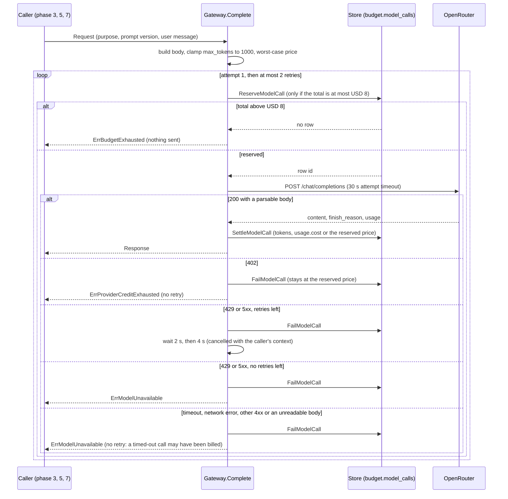
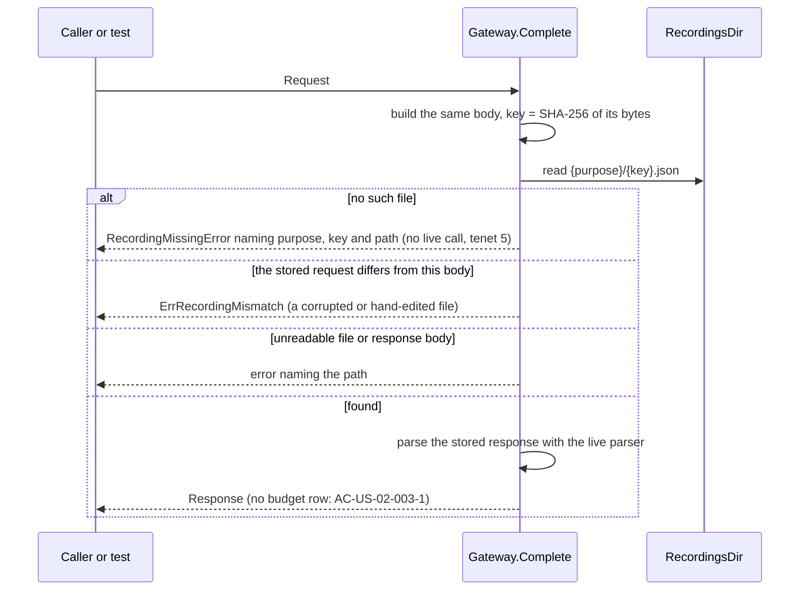

# Low Level Design: model gateway, build phase 2 (budget, record and replay, prompt versions)

- Task: none (no task ids yet). HLD: [review-intelligence-hld.md](review-intelligence-hld.md) sections 3, 4, 6, 8, 10 and 12 (phase 2). ADRs: [0001](../adr/0001-use-go-for-the-server.md), [0003](../adr/0003-use-sqlc-pgx-and-goose-for-data-access.md), [0004](../adr/0004-use-github-actions-for-ci.md), [0008](../adr/0008-tag-and-draft-with-prompt-only-haiku-calls.md) (Proposed; constrains the callers in phases 3 and 5, not this design)
- Author: unattributed (no `.bearing/company.json`), 2026-10-07, status Draft
- Version: v1
- Companions: [data-model.md](data-model.md) (`budget.model_calls`, migration B1), [GenAI solution](../genai/review-classification-and-replies-solution.md) sections 4.3, 4.4 and 5, [tenets](../architecture/tenets.md) 1, 2 and 5

Serves: US-02-001, US-02-002 (the registry part), US-02-003, REQ-030 to REQ-035, Q-011, Q-015, Q-016, tenets 1, 2 and 5.
Acceptance criteria the tests below prove: AC-US-02-001-1 to AC-US-02-001-7, AC-US-02-002-1 (the mechanism; the tagging and reply versions land in phases 3 and 5), AC-US-02-003-1 to AC-US-02-003-3. AC-US-02-002-2 (a stored tag or draft names its version) is proved by the tables that store tags and drafts, in phases 3 and 5; this phase records the version on every cost row.

Decisions taken in session for this design (2026-10-07, product owner):

| Point | Decision | Effect on this phase |
| --- | --- | --- |
| Prompt files | Registry only. The loader and its rules ship now, tested with fixture prompts; `tagging/v1` ships with phase 3 (its line format and theme codes are set there), `reply/v1` with phase 5 (the tone) | AC-US-02-002-1 is complete once phase 5 lands |
| Default gateway mode | `replay` when `MODEL_GATEWAY_MODE` is unset | Nothing spends money unless the operator chooses `live` or `record` |
| Checks before the first live call | A checklist (section 10), done before phase 3's first live call; no command in this phase | Phase 2 makes no live call (HLD section 12) |
| Tests of the live path | A loopback `httptest` server inside the test answers like OpenRouter; nothing leaves the machine | Retries, 402, timeouts and settling are tested without a key or spend |

Also decided here, from the HLD and data model, with no new dependency:

- The worst-case price reserved before a call counts every byte of the request body as one input token (section 3), so no tokenizer is needed.
- The budget migration set uses its own goose version table, `goose_budget_version`, in `public`: goose creates its table before the migration creates the `budget` schema.
- A call's cost row is settled or failed on a context the caller cannot cancel, so a closed browser tab never leaves a paid call unlogged (HLD section 16, MINOR "side effect then record").

## 1. Scope

The model gateway in `internal/gateway/`: the only code that talks to OpenRouter. It caps max_tokens, refuses calls once the recorded total is above USD 8, reserves and settles a cost row in `budget.model_calls` around every live HTTP attempt, retries 429 and 5xx, records and replays responses, and reconciles the total with OpenRouter's key usage once at server start. It also covers the prompt registry in `prompts/`, the budget migration set, its queries, and the start-up wiring. The callers (the tagging worker, drafting, the eval and tone-check commands) and every HTTP route that reports budget state stay outside: they arrive in phases 3, 5 and 7, and phase 2 adds no endpoint.

## 2. Module layout

Follows the `bearing-backend:go` layout. Line counts are estimates.

| Path | Owns | Est. lines |
| --- | --- | --- |
| `db/migrations/budget/00001_create_model_calls.sql` (new) | the `budget` schema, `model_call_purpose`, `model_call_outcome`, `model_calls` with its four CHECKs, exactly as `docs/design/schema.sql`; Up only, no Down section | 45 |
| `db/migrations/README.md` | names the budget set, its version table and why it has no Down | +6 |
| `db/queries/model_calls.sql` (new) | `ReserveModelCall`, `SettleModelCall`, `FailModelCall`, `RunningTotalUSD`, `InsertReconciliation` (section 5) | 50 |
| `sqlc.yaml` | `schema: [db/migrations, db/migrations/budget]` | +1 |
| `internal/store/model_calls.sql.go` (generated) | sqlc output; never edited | generated |
| `internal/store/model_calls.go` (new) | the store methods the gateway's `Store` interface names; maps "no row" from the reserve to `gateway.ErrBudgetExhausted`; costs cross as decimal strings | 80 |
| `internal/store/storetest/storetest.go` | migrates the budget set too: `goose -dir db/migrations/budget -table goose_budget_version up` after the domain set | +12 |
| `Makefile` | `migrate` and `migrate-status` run both sets; `migrate-down` stays domain-only, with a comment that the budget set is never rolled back | +6 |
| `prompts/prompts.go` (new) | `Version`, `Registry`, `Parse(fs.FS)`, `Current(name)`, `Get(name, n)`: the versioned prompt files and their rules (section 3). No `//go:embed` yet: an embed pattern with no matching file does not compile, so phase 3 adds it with `tagging/v1.md` | 140 |
| `prompts/README.md` (new) | the layout and the rules: never edit or delete a version; a theme-list change is a new tagging version | 30 |
| `prompts/testdata/` (new) | fixture prompts for the registry tests only | 20 |
| `internal/gateway/gateway.go` (new) | `Config`, `New`, `Gateway.Complete`, mode dispatch, the per-call log line | 150 |
| `internal/gateway/request.go` (new) | `Purpose`, `Request`, `Response`, the request body with a fixed field order, the max_tokens clamp, the worst-case price | 110 |
| `internal/gateway/openrouter.go` (new) | the live sender: one HTTP attempt, response parsing, status classification, the retry loop with backoff, the key endpoint | 170 |
| `internal/gateway/recording.go` (new) | the recording key, `record` (write after a live answer) and `replay` (read; never builds an HTTP client) | 120 |
| `internal/gateway/reconcile.go` (new) | `Reconcile`: once at server start in live and record modes | 70 |
| `internal/gateway/errors.go` (new) | the sentinel errors and `RecordingMissingError` (section 6) | 45 |
| `internal/gateway/*_test.go` (new) | unit tests with a fake store and a loopback OpenRouter (section 8) | 600 over 4 files |
| `internal/gateway/onedoor_test.go` (new) | the code-search test for AC-US-02-001-1 | 50 |
| `internal/store/model_calls_integration_test.go` (new) | the USD 8 boundary, restart survival and reconciliation against a per-run database | 170 |
| `internal/config/config.go` | `GatewayMode`, `OpenRouterKey`, `RecordingsDir` (section 7) | +35 |
| `cmd/api/main.go` | builds the gateway after the users sync, reconciles, logs the budget line; refuses to start without the budget table | +40 |
| `.env.example`, `AGENTS.md` | the three variables; the migrate note and the replay default | +12 |
| `testdata/recordings/` (new, empty in phase 2) | where `record` writes and `replay` reads; a `README.md` says seed text only, never real customer reviews (HLD section 4 risks) | 10 |

No hand-written file is expected to pass 400 lines. `internal/gateway` imports `prompts` only; `internal/store` imports `internal/gateway` for its `Store` interface and error, as it already imports `auth` and `outlets`.

## 3. Types and schemas

`prompts` package:

| Type | Holds | Validated in |
| --- | --- | --- |
| `Version` | `Name` (`tagging`, `reply`, or a fixture name), `Number` (1, 2, ...), `Text` (the system prompt), `MaxTokens` (1 to 1000), `Temperature` (`*float64`, nil means the provider default) | `prompts.Parse`, once, when the registry is built |
| `Registry` | every version of every prompt, and the current number of each | `prompts.Parse` |

Prompt files: `prompts/<name>/v<N>.md` and `prompts/<name>/current`. A version file starts with a header of `key: value` lines between two `---` lines (`max_tokens: 1000`, optional `temperature: 0`), then the prompt text. `current` holds one number. The current marker lives outside the version files, so making v2 current never edits v1 (GenAI section 4.3: versions are never edited). `Parse` refuses: a missing or non-numeric `current`, a `current` naming a version that does not exist, a gap in the numbers (v1, v3), `max_tokens` outside 1 to 1000, an unknown header key, and empty text.

`gateway` package:

| Type | Holds | Validated in |
| --- | --- | --- |
| `Mode` | `live`, `record`, `replay` | `config.Load` (section 7) |
| `Purpose` | `tagging`, `drafting`, `evaluation`, `tone_check`; the same values as `budget.model_call_purpose` minus `reconciliation`, which only `Reconcile` writes | `Gateway.Complete`: an unknown purpose is a programming error and returns an error before anything is reserved |
| `Request` | `Purpose`, `Prompt prompts.Version`, `User string` (the user message) | `Gateway.Complete` |
| `Response` | `Text`, `FinishReason` (`stop`, `length`, ...), `InputTokens`, `OutputTokens`, `Mode` | built by the parser in `openrouter.go`, used by both live and replay |
| `Config` | `Mode`, `APIKey`, `BaseURL`, `RecordingsDir`, `Store`, `Logger`, `AttemptTimeout` (default 30 s), `Backoff` (default 2 s, 4 s) | `gateway.New` |

Request body sent to `POST {BaseURL}/chat/completions`, marshalled from a Go struct so the field order is fixed (the recording key depends on the exact bytes):

```json
{"model":"anthropic/claude-haiku-4.5","messages":[{"role":"system","content":"<prompt text>"},{"role":"user","content":"<User>"}],"max_tokens":1000,"temperature":0,"reasoning":{"enabled":false}}
```

- `model` is a constant in `request.go`, never configuration: one model, no fallback (Q-016, AC-US-02-001-7).
- `max_tokens` is the prompt version's value, clamped to 1000; a zero value becomes 1000 (AC-US-02-001-3).
- `temperature` is left out when the version sets none.
- `"reasoning": {"enabled": false}` on every request: thinking stays off (GenAI section 5). Changed by ADR-0009: a reasoning model otherwise spends the 1000-token cap thinking.

Response fields read: `choices[0].message.content`, `choices[0].finish_reason`, `usage.prompt_tokens`, `usage.completion_tokens`, `usage.cost` (decoded as `json.Number`, so no float rounding). The body is read through a 1 MiB limit.

Money: costs cross between Go and PostgreSQL as decimal strings and are compared in SQL against `numeric(12,8)`. Go computes only the reserved price, as an integer count of 1e-8 USD (the column's scale), and formats it as `%d.%08d`.

- Worst-case price = request body bytes x USD 1 per million + max_tokens x USD 5 per million (GenAI section 5 prices, an assumption until checked, section 10).
- Every token is at least one byte, and the JSON keys and quoting add more bytes than the message framing adds tokens, so the body's byte count is an upper bound on input tokens.
- That bound over-reserves English text about 4 times (a typical tagging batch reserves about USD 0.015 against HLD section 8's USD 0.0076). That is the safe side of REQ-031: the reserve only counts while a call is in flight, or when a call failed.

Recording file: `{RecordingsDir}/{purpose}/{key}.json`, where `key` is the lowercase hex SHA-256 of the exact request body bytes. The body already holds the model, the prompt text (so its version) and the user message, which is what HLD section 5 keys on. The file holds `{"key", "purpose", "prompt": {"name", "version"}, "request": <body>, "response": <raw response body>}` and is written to a temporary file in the same directory, then renamed, so a crash never leaves half a recording.

## 4. Sequence

### 4.1 A live call (`live` mode)



Every settle and fail runs on `context.WithoutCancel(ctx)` with a 5 second timeout, so a caller that gives up never leaves a paid call unsettled. If the settle or fail write itself fails, the row stays `reserved` and keeps counting at its reserved price (HLD section 4 risk: over-counting is the safe side), and the error is logged. Each retry reserves a new row, so a retry re-checks the budget and can end with `ErrBudgetExhausted`.

### 4.2 Record mode

```mermaid
sequenceDiagram
    participant C as Caller (seed, eval, tone check)
    participant G as Gateway.Complete
    participant L as live path (4.1)
    participant F as RecordingsDir
    C->>G: Request
    G->>L: the whole of 4.1
    alt live path returned a Response
        L-->>G: Response and the raw response body
        G->>F: write {purpose}/{key}.json (temporary file, then rename)
        alt write failed
            G-->>C: error "recording not saved" (the call is paid and logged; the developer fixes the directory and records again)
        else written
            G-->>C: Response
        end
    else live path returned an error
        L-->>G: error
        G-->>C: the same error; nothing is written
    end
```

### 4.3 Replay mode



In replay mode `New` builds no `http.Client` and the gateway holds no sender, so no code path can reach the network (HLD section 12 phase 0, tenet 5).

### 4.4 Server start: budget check and reconciliation

```mermaid
sequenceDiagram
    participant M as cmd/api main
    participant G as Gateway
    participant S as Store
    participant O as OpenRouter key endpoint
    M->>G: New(config) after the users sync
    M->>S: RunningTotalUSD
    alt undefined table (42P01)
        S-->>M: error
        M-->>M: refuse to start "the budget table does not exist; run make migrate"
    else other database error
        M-->>M: refuse to start with the error
    end
    alt mode replay
        M->>M: log budget: mode replay, total, reconciliation skipped
    else mode live or record
        M->>G: Reconcile (10 s timeout)
        G->>O: GET /key
        alt answered with data.usage
            G->>S: InsertReconciliation(usage): inserts the difference only when usage is higher
            G-->>M: reconciled (added or not)
        else unreachable, non-200 or unreadable
            G-->>M: unreconciled (the local total stands)
        end
        M->>M: log budget: mode, total, reconciled or unreconciled (BudgetUnreconciled, HLD section 10)
    end
    M->>M: serve
```

An unreconciled start never stops the server (HLD section 6). Only the server reconciles; the seed, eval and tone-check commands never do, so one difference is never inserted twice (data model section 4).

## 5. Data access

Migration, in order, as `db-migration` names it: `budget/00001_create_model_calls`, data model section 8 row B1.

- Up only, with no Down section.
- Starts with `SET lock_timeout = '2s'; SET statement_timeout = '60s';`.
- Creates a new schema and an empty table, so there's no lock risk and no backfill.
- Applied with `goose -dir db/migrations/budget -table goose_budget_version up`.
- `make migrate` runs the domain set, then the budget set; `make migrate-status` shows both.
- `make migrate-down` runs the domain set only. Nothing in the repository runs `down` on the budget set, and a test checks the file has no Down section.

Queries, all on `budget.model_calls`. The table has no index by design (data model section 4): the running total sums at most about 10^4 rows, a known sequential scan accepted in data model section 9.

| Query | Shape | Index |
| --- | --- | --- |
| `ReserveModelCall :one` | `INSERT INTO budget.model_calls (purpose, model, prompt_version, reserved_cost_usd) SELECT $1, $2, $3, $4::numeric WHERE (SELECT coalesce(sum(coalesce(settled_cost_usd, reserved_cost_usd)), 0) FROM budget.model_calls) <= $5::numeric RETURNING id`; `$5` is the limit, `8` | full scan for the total, about 10^4 rows; insert by primary key |
| `SettleModelCall :execrows` | `UPDATE ... SET outcome = 'settled', input_tokens = $2, output_tokens = $3, settled_cost_usd = $4::numeric, updated_at = now() WHERE id = $1 AND outcome = 'reserved'` | `model_calls_pkey` |
| `FailModelCall :execrows` | `UPDATE ... SET outcome = 'failed', updated_at = now() WHERE id = $1 AND outcome = 'reserved'` | `model_calls_pkey` |
| `RunningTotalUSD :one` | `SELECT coalesce(sum(coalesce(settled_cost_usd, reserved_cost_usd)), 0)::text` | full scan, about 10^4 rows |
| `InsertReconciliation :one` | `INSERT INTO budget.model_calls (purpose, reserved_cost_usd, settled_cost_usd, input_tokens, output_tokens, outcome) SELECT 'reconciliation', d, d, 0, 0, 'settled' FROM (SELECT $1::numeric - coalesce(sum(coalesce(settled_cost_usd, reserved_cost_usd)), 0) AS d FROM budget.model_calls) x WHERE d > 0 RETURNING settled_cost_usd::text` | full scan, about 10^4 rows |

- `$4::numeric` and `$1::numeric` take decimal strings (section 3).
- The settle and fail conditions on `outcome = 'reserved'` make a second write a no-op: zero rows affected is logged, never an error a caller sees.

Transactions: none spans a model call. Each query is one statement in its own transaction:
- **Reserve** is one statement, so the total it reads and the row it adds come from the same snapshot. Holding a transaction across a 30 second HTTP call would hold a connection, and would hide the reserved row from every other caller's check, which is the opposite of what the reserve is for (HLD section 3).
- **Concurrent reserves** can each read a total at or below USD 8 and all insert. HLD section 8 accepts that overshoot: about 7 calls in flight, about USD 0.05, under the USD 10 key cap, and Q-015 allows the crossing call.

Who writes, and how many at once:
- The server process: the tagging worker from phase 3 (one call in flight, ADR-0006) and drafts from phase 5 (one per review, through the claimed reply row).
- The seed, eval and tone-check commands, in their own processes (phase 7).
- All of them share the one table, so the budget is the database total and never a value in memory (tenet 2).
- The gateway itself holds no state between calls, so a second server process started by mistake also reads and adds to the same total.

## 6. Errors

| Error | Created in | Wrapped in | Mapped by |
| --- | --- | --- | --- |
| `ErrBudgetExhausted` | `internal/store/model_calls.go` (the reserve returned no row) | `gateway.Complete` adds the purpose | phase 3: the tagging pass ends; phase 5: 503 `budget_exhausted` (already in api/openapi.yaml); phase 7: the command exits non-zero |
| `ErrProviderCreditExhausted` | `openrouter.go` on HTTP 402 | `Complete` adds the purpose and OpenRouter's `error.metadata.limit_source` when present | phase 3: the pass ends; phase 5: 503 `budget_exhausted`; the HLD treats 402 like the USD 8 stop (section 6) |
| `ErrModelUnavailable` | `openrouter.go`: timeout, network error, 429 or 5xx after the retries, other 4xx (a missing model included, AC-US-02-001-7), unreadable body | `Complete` adds the status or cause (never the prompt, the user message or the key) | phase 3: those ids wait for the next pass; phase 5: 503 `model_unavailable` |
| `RecordingMissingError` (matches `ErrRecordingMissing`) | `recording.go` | not wrapped: its message names the purpose, key and path (AC-US-02-003-2) | tests and the seed fail with it |
| `ErrRecordingMismatch` | `recording.go` | adds the path | test or seed failure |
| `ErrRecordingNotSaved` | `recording.go` in record mode | adds the path and the write error | the command fails; the call stays logged |
| configuration errors | `internal/config/config.go` | joined with the other problems, as phase 1 does | the server refuses to start |

No error reaches an HTTP client in this phase. Every gateway error message leaves out the prompt text, the user message, review text and the key; log lines carry ids, tokens and cost only (GenAI section 6, PII row).

One log line per model call (HLD section 10): `model call` with `purpose`, `prompt`, `prompt_version`, `mode`, `attempt`, `input_tokens`, `output_tokens`, `reserved_usd`, `settled_usd`, `outcome` (`settled`, `failed`, `refused`, `replayed`), `status` and `duration_ms`. At start, one `budget` line: `mode`, `total_usd`, `reconciliation` (`skipped`, `added`, `not needed`, `unreconciled`) and, when added, the amount.

## 7. Configuration

| Variable | Default | When missing or wrong |
| --- | --- | --- |
| `MODEL_GATEWAY_MODE` | `replay` | unset: replay. A value other than `live`, `record` or `replay`: the server refuses to start, naming the three values |
| `OPENROUTER_API_KEY` | none | required when the mode is `live` or `record`: the server refuses to start without it. Ignored in `replay`. Never logged, never in CI (ADR-0004) |
| `MODEL_RECORDINGS_DIR` | `testdata/recordings` | relative to the working directory; `record` creates `{purpose}/` under it; `replay` reports a missing file with its full path |

Constants in code, not configuration: the default model `anthropic/claude-haiku-4.5` (Q-016; `MODEL_ID` replaces it for a run, ADR-0009), the base URL `https://openrouter.ai/api/v1`, the limit USD 8 (REQ-031), the cap of 1000 tokens (REQ-032), the 30 s attempt timeout and the 2 s and 4 s backoff (HLD section 8), and the prices of USD 1 and USD 5 per million tokens (GenAI section 5). Tests set the timeout, the backoff and the base URL through `gateway.Config`; no environment variable exists for them, except `MODEL_ID` for the model.

Missing from `.env.example` today: all three. Item G7 adds `MODEL_GATEWAY_MODE=replay`, an empty `OPENROUTER_API_KEY=`, and `MODEL_RECORDINGS_DIR=testdata/recordings`, unquoted because none holds a space (the file is sourced as shell). It also replaces the commented `OPENROUTER_API_KEY` placeholder line.

## 8. Tests

Unit tests use a fake `Store` that keeps rows in memory with the same rules (the reserve refuses above the limit; settle and fail only change a `reserved` row) and, for live behaviour, a loopback `httptest.Server` that answers like OpenRouter and counts requests (decided in session). No test reaches the network and none needs a key (tenet 5).

Prompts (`prompts/prompts_test.go`):

- `TestParse_LoadsVersionsAndTheCurrentOne` proves AC-US-02-002-1 (the mechanism).
- `TestParse_RefusesCurrentNamingAMissingVersion`
- `TestParse_RefusesAGapInVersionNumbers`
- `TestParse_RefusesMaxTokensAbove1000` proves AC-US-02-001-3 (at the prompt).
- `TestParse_ReadsTemperatureOnlyWhenSet`
- `TestParse_RefusesAnUnknownHeaderKey`

Request building (`internal/gateway/request_test.go`):

- `TestBody_ClampsMaxTokensTo1000` proves AC-US-02-001-3 (a version asking 4000 sends 1000).
- `TestBody_ZeroMaxTokensBecomes1000` proves AC-US-02-001-3.
- `TestBody_SendsTheHaikuModel` proves AC-US-02-001-7.
- `TestBody_OmitsTemperatureWhenUnset`
- `TestWorstCasePrice_CountsBodyBytesAndMaxTokens`: a 10,000-byte body at 1000 tokens reserves USD 0.01500000.

Live path (`internal/gateway/live_test.go`):

- `TestComplete_ReservesThenSettlesWithUsageCost` proves AC-US-02-001-2 (model, tokens, cost, time on the row).
- `TestComplete_KeepsTheReservedPriceWhenUsageCostIsMissing`
- `TestComplete_RefusedBudgetSendsNothing` proves AC-US-02-001-4 (the server counts 0 requests).
- `TestComplete_Retries429ThenSucceeds`: the retry succeeds; two rows, the first `failed`, the second `settled`.
- `TestComplete_GivesUpAfterTwoRetries`: three 503s, three `failed` rows, then `ErrModelUnavailable`.
- `TestComplete_RetryRechecksTheBudget`: a 429, then the reserve refuses, so `ErrBudgetExhausted` after one request.
- `TestComplete_402StopsWithoutRetry`: one request, `ErrProviderCreditExhausted`.
- `TestComplete_MissingModelFailsWithNoFallback` proves AC-US-02-001-7: a 404, exactly one request, the same model, `ErrModelUnavailable`.
- `TestComplete_TimeoutFailsTheRowAtItsReservedPrice`: the attempt timeout is set to 50 ms in the test.
- `TestComplete_CancelledCallerStillFailsTheRow`: the caller's context is cancelled mid-request; the row ends `failed`, not `reserved`.
- `TestComplete_UnreadableBodyIsModelUnavailable`
- `TestComplete_LogLineCarriesNoPromptOrUserText`

Record and replay (`internal/gateway/recording_test.go`):

- `TestReplay_AnswersFromTheRecordingAndWritesNoBudgetRow` proves AC-US-02-003-1.
- `TestReplay_MissingRecordingNamesItsKeyAndPath` proves AC-US-02-003-2.
- `TestReplay_NeverBuildsAnHTTPClient` proves AC-US-02-003-3 (with CI's blocked host and no key): the replay gateway holds no sender.
- `TestReplay_RefusesARecordingWhoseRequestDiffers`
- `TestRecord_SavesTheResponseUnderTheRequestKey`: record against the loopback server, then a replay gateway answers the same request.
- `TestRecord_FailedCallWritesNoFile`
- `TestRecordingKey_ChangesWithThePromptVersion`

Reconciliation (`internal/gateway/reconcile_test.go`):

- `TestReconcile_ProviderHigherInsertsTheDifference`
- `TestReconcile_LocalHigherInsertsNothing`
- `TestReconcile_KeyEndpointDownIsUnreconciled`
- `TestReconcile_SkippedInReplayMode`

One door (`internal/gateway/onedoor_test.go`):

- `TestOnlyTheGatewayNamesOpenRouter` proves AC-US-02-001-1. It walks every `.go` file in the module outside `internal/gateway/` and fails on `openrouter.ai`, `/chat/completions` or `OPENROUTER_API_KEY` (config reads the key and passes it in, so `internal/config` is the one allowed exception, named in the test).

Integration, against a per-run database (`internal/store/model_calls_integration_test.go`, `-tags=integration`):

- `TestReserveModelCall_RefusesAboveEightDollars` proves AC-US-02-001-4 (a total of 8.01 inserts nothing).
- `TestReserveModelCall_AllowsAtExactlyEightAndRefusesTheNext` proves AC-US-02-001-5: totals of 7.99 and 8.00 both reserve; the crossing call is allowed, the next is refused.
- `TestRunningTotal_SurvivesAReconnect` proves AC-US-02-001-6: close the pool, open a new one, same total.
- `TestSettleAndFail_OnlyChangeAReservedRow`
- `TestInsertReconciliation_OnlyWhenTheProviderIsHigher`
- `TestBudgetMigrations_HaveNoDown`: reads `db/migrations/budget/*.sql` and fails on `+goose Down` (HLD section 4).

Configuration (`internal/config/config_test.go`):

- `TestLoad_GatewayModeDefaultsToReplay`
- `TestLoad_LiveAndRecordNeedTheKey`
- `TestLoad_RejectsAnUnknownMode`
- `TestEnvExampleLoadsLikeMakeDev` (from the phase 1 fix) covers the three new lines with no change.

End to end: none. Phase 2 has no caller and no route. A manual check at the end of G7: `make migrate`, then `make dev` in replay mode logs the `budget` line with `reconciliation: skipped`. A start with `MODEL_GATEWAY_MODE=live` and no key is refused. No live call is made.

## 9. Work breakdown

Each item is one commit on its own branch and leaves `make check` green. The integration tests run in CI's integration job and through `make test-integration`.

- **G1. Budget migration and its wiring.** `db/migrations/budget/00001_create_model_calls.sql`, `db/migrations/README.md`, `Makefile` (`migrate`, `migrate-status`), `internal/store/storetest/storetest.go`, `TestBudgetMigrations_HaveNoDown`. About 110 lines.
- **G2. Budget queries and store methods.** `db/queries/model_calls.sql`, `sqlc.yaml`, generated `internal/store/model_calls.sql.go`, `internal/store/model_calls.go`, and the five store integration tests. `ErrBudgetExhausted` is defined here in `internal/gateway/errors.go`, alone, so the store can return it. About 330 lines plus generated code.
- **G3. Prompt registry.** `prompts/prompts.go`, `prompts/README.md`, `prompts/testdata/`, the six prompt tests. About 290 lines.
- **G4. Gateway core, one attempt.** `internal/gateway/gateway.go`, `request.go`, `openrouter.go` (one attempt, parsing, classification; no retry yet), the rest of `errors.go`, the `Store` interface and its assertion in `internal/store/model_calls.go`; the request tests and the live tests that need no retry. About 390 lines.
- **G5. Retries, timeouts and cancellation.** The retry loop with backoff in `openrouter.go`, the attempt timeout, settling on a context the caller cannot cancel; the retry, 402, timeout and cancel tests. About 230 lines.
- **G6. Record and replay.** `internal/gateway/recording.go`, `testdata/recordings/README.md`, the recording tests and `onedoor_test.go`. About 320 lines.
- **G7. Reconciliation, configuration and start-up.** `internal/gateway/reconcile.go`, `internal/config/config.go`, `cmd/api/main.go`, `.env.example`, `AGENTS.md`, the reconcile and config tests, then the manual start check. About 300 lines.

Order check:
- G2's store needs G1's table.
- G4 uses G2's store methods and G3's `prompts.Version`.
- G5 extends G4's attempt.
- G6 reuses G4's body and parser.
- G7 needs G2's `RunningTotalUSD` and `InsertReconciliation`, and G4's `New`.
- `ErrBudgetExhausted` is defined in G2, before G4 uses it.

Largest item: about 390 lines (G4).

## 10. Assumptions

- assumption: one OpenRouter credit equals USD 1, both in `usage.cost` and in the key endpoint's `data.usage`, so the USD 8 stop matches real spend (HLD section 17). Owner: product owner, in the OpenRouter dashboard. Needed by phase 3's first live call.
- assumption: OpenRouter's identifier for Claude Haiku 4.5 is `anthropic/claude-haiku-4.5` (Q-016, AC-US-02-001-7). Owner: developer, from the model page. Needed by phase 3's first live call.
- assumption: prices are USD 1 and USD 5 per million input and output tokens on OpenRouter. They are used only for the reserved price. Owner: developer, from the model page. Needed by phase 3.
- assumption: every chat completion response carries `usage.cost` with no opt-in (HLD section 6, critic's weakest claim 2). If it does not, every settled row keeps its reserved price and the total over-counts, the safe side. Owner: developer, from the first live response. Needed by phase 3.
- assumption: `GET /key` returns `data.usage` as the key's lifetime spend in credits (HLD section 6). Owner: developer. Needed by phase 3.
- assumption: OpenRouter chat completions take no idempotency key, so a timed-out call is never retried by the gateway (HLD section 17). Owner: developer, from the API reference. Checked in G5.
- assumption: a loopback `httptest` server inside a test does not breach tenet 5. Decided in session (2026-10-07): it reaches no network, uses no key and spends nothing.
- assumption: the recording key covers the exact body bytes. A change to the body struct's field order, or a new field, therefore makes every recording stale and needs a deliberate record run. The same holds for a new prompt version (HLD section 12 risks).

The checks before phase 3's first live call (decided in session, done by hand, no command):

1. The model identifier on OpenRouter's model page.
2. That the dashboard shows usage in USD.
3. The two prices.
4. The key's cap of USD 10.
5. That `MODEL_GATEWAY_MODE` is set to `record` only on purpose.
