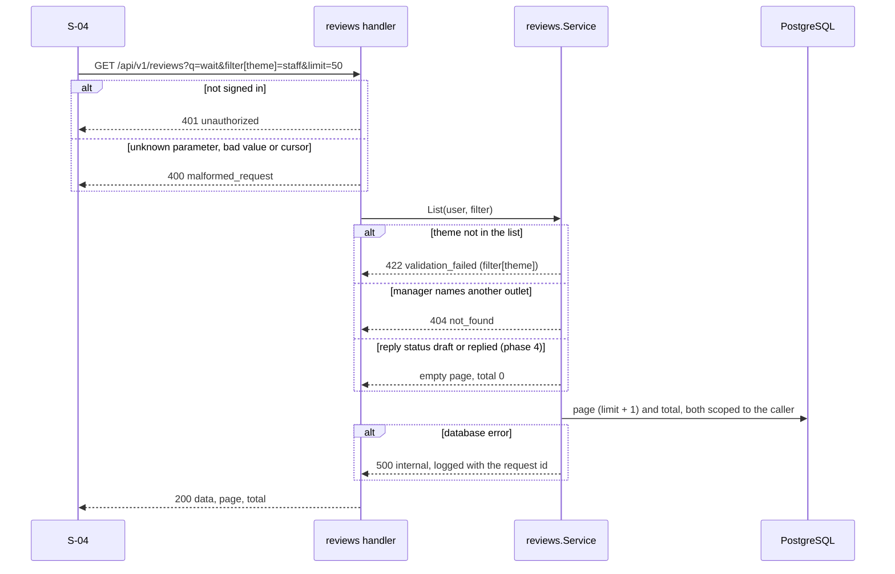

# Low Level Design: dashboard and search, build phase 4

- Task: none (no task ids yet). HLD: [review-intelligence-hld.md](review-intelligence-hld.md) sections 2 (flows A step 5, B step 1), 3, 5, 9 and 12 (phase 4). ADRs: [0002](../adr/0002-use-react-and-vite-for-the-ui.md), [0003](../adr/0003-use-sqlc-pgx-and-goose-for-data-access.md), [0005](../adr/0005-use-rest-with-openapi-for-the-api.md), [0007](../adr/0007-use-jwt-cookies-for-sign-in.md)
- Author: unattributed (no `.bearing/company.json`), 2026-10-08, status Draft
- Version: v1
- Companions: [data-model.md](data-model.md) (sections 4 and 9), `api/openapi.yaml` (listReviews, getTrends, getHeatmap, getMovers, getTaggingStatus, listThemes), screens `app/S-02`, `app/S-03`, `app/S-04`, [phase 3 LLD](phase-3-import-and-tagging-lld.md) (what this phase reads)

Serves: US-01-005, US-01-006, US-01-007, US-01-008, US-00-001 (dashboard and review parts), US-02-001 (budget state on screen), REQ-015 to REQ-019, REQ-044 to REQ-046, REQ-048, Q-002, Q-004, Q-005, Q-013, Q-020, Q-021, tenets 3 and 6.
Acceptance criteria the tests below prove: AC-US-01-005-1 to -3, AC-US-01-006-1, -2, AC-US-01-007-1 to -3, AC-US-01-008-1 to -4, AC-US-00-001-2 to -4. The design-system criteria (AC-US-01-005-4, AC-US-01-006-3, AC-US-01-007-4, AC-US-01-008-5) are checked by eye against the screens at definition-of-done, not by a test. AC-US-01-007-2 (the planted spike ranks first) needs the phase 7 seed; here a fixture with a spike proves the ranking.

Decisions this design rests on:

| Point | Decision | Source |
| --- | --- | --- |
| Fonts | `@fontsource/plus-jakarta-sans` and `@fontsource/noto-sans-devanagari`, pinned, imported in `main.tsx`; Vite bundles the files, nothing from a CDN | product owner, 2026-10-08; HLD section 3 |
| Charts | Hand-written SVG sparklines (one `<polyline>` each), no chart library; each carries an `aria-label` naming its first and last value, as the S-02 mockup does | AGENTS.md rule 6 (no unasked dependency); S-02 |
| Sentiment trend form | The weekly share of tagged reviews that are negative, as the S-02 "Negative 12 weeks" column shows | backlog US-01-005 ("chart form set in design"); S-02 |
| Replies before phase 5 | The `replies` table arrives in phase 5. Until then `reply_status` is `none` on every review, `filter[reply_status]=draft` or `replied` matches nothing, `TrendWeek.replied` is 0, and the screens hide the Replied column and the Reply filter | HLD section 12; same pattern as phase 1's zero counts |
| Deferred | `GET /reviews/{id}` and S-05 (phase 5, where a review is opened to reply): the "Open review" links and row links to a review wait for it | HLD section 12 |
| Mobile bottom tabs | Built now (Overview, Reviews, Themes, Import, More), as the phase 1 web LLD deferred them to phase 4 | phase 1 web LLD section 3 |

## 1. Scope

The read side of the product: the review list with search and filters, the three dashboard reports (trends, heatmap, movers), the tagging and budget status, the theme list, and the S-02, S-03 and S-04 screens with the top bar status. Everything is read only and scoped to the caller's outlets (tenet 3); nothing calls the model.

## 2. Module layout

| File | Owns | Est. lines |
| --- | --- | --- |
| `db/queries/reviews.sql`, `db/queries/dashboard.sql` (new); `db/queries/model_calls.sql` | the list and its count; weekly outlet stats, negative theme counts, review counts; budget cents | 150 |
| `internal/store/reviews.go`, `internal/store/dashboard.go` (new) | domain types out, scope passed as `all` plus `outlet_id` | 220 |
| `internal/reviews/service.go`, `internal/reviews/cursor.go` (new) | filter validation, the outlet scope check, the cursor, `ILIKE` escaping | 230 |
| `internal/dashboard/weeks.go`, `internal/dashboard/service.go` (new) | weeks from an injected clock and the brand timezone; trends, heatmap and movers assembly and ranking | 300 |
| `internal/gateway/gateway.go` | `CreditExhausted()`: set by a 402, cleared by a settled live call | 20 |
| `internal/tagging/worker.go` | `State()`: paused, running or idle | 20 |
| `internal/httpapi/reviews_handler.go`, `dashboard_handler.go`, `tagging_handler.go` (new); `server.go`, `errors.go` | the six routes, query parsing, response mapping | 380 |
| `cmd/api/main.go` | wire the services; the clock is `time.Now` | 20 |
| `web/src/main.tsx`, `web/package.json`, `web/src/styles/tokens.css` | font imports | 10 |
| `web/src/features/status/*` (new); `web/src/components/AppShell.tsx` | top bar tagging and budget status; nav items Reviews and Themes; bottom tabs | 220 |
| `web/src/features/overview/*` (new) | S-02: week line, movers table, urgent list, outlet comparison with sparklines, the partial, budget-stop, tagging-paused and manager states | 380 |
| `web/src/features/themes/*` (new) | S-03: heatmap table with counts in every cell, legend, mobile blocks | 220 |
| `web/src/features/reviews/*` (new) | S-04: filters bound to the URL, table, load more, empty, no-results, not-found states | 390 |

## 3. Types and boundaries

- HTTP shapes are `api/openapi.yaml`; this phase adds no field. The web types come from `api-types.ts`.
- `reviews.Filter` (validated once in `reviews.Service.List`): `Q` (trimmed; blank means no search; at most 200 characters), `OutletID`, `Theme` (must be in `tagging.Themes`, else a `ValidationError` on `filter[theme]`, 422), `Sentiment`, `Urgent`, `ReplyStatus`, `From`, `To`, `Limit` (1 to 100, default 50), `Cursor`.
- `reviews.Cursor`: base64url of `{"d":"2026-10-03","i":1497}`; anything else is 400 `malformed_request`.
- The handler is the one place query strings are parsed: an unknown parameter, a bad boolean, date or enum, or a limit out of range is 400 `malformed_request` (Error table: "a filter is not in the spec").
- `dashboard.Weeks`: from `now` in the brand timezone, `today` is a calendar date; the latest complete week starts on the Monday 7 days before this week's Monday. Trends cover the 12 weeks ending with it, the heatmap 4, movers it and the week before.

## 4. Sequences



```mermaid
sequenceDiagram
    participant UI as S-02 or S-03
    participant H as dashboard handler
    participant D as dashboard.Service
    participant DB as PostgreSQL
    UI->>H: GET /api/v1/dashboard/{trends|heatmap|movers}
    alt not signed in
        H-->>UI: 401 unauthorized
    end
    H->>D: report(user)
    D->>D: weeks from the clock and BRAND_TIMEZONE
    D->>DB: outlets in scope; grouped counts for the window, scoped
    alt database error
        D-->>H: 500 internal
    end
    D->>D: fill missing weeks and themes with zeros; rank movers
    H-->>UI: 200 report
```

The tagging status and theme list follow the dashboard sequence with no window: 401 when not signed in, 500 on a database error.

## 5. Data access

| Query | Shape | Index |
| --- | --- | --- |
| `ListReviews` | `reviews` left join `review_tags`, scope `(all OR outlet_id = $o)`, optional filters as `(narg IS NULL OR ...)`, `ILIKE $q ESCAPE '\'` on text and reviewer name, keyset `(review_date, id) < ($d, $i)`, `ORDER BY review_date DESC, id DESC LIMIT n+1` | manager: `idx_reviews_outlet_id_review_date`; admin: known full scan, at most about 10^4 rows (data model section 9) |
| `CountReviews` | the same filters without the keyset, `count(*)` | as above |
| `WeeklyOutletStats` | per outlet and `date_trunc('week', review_date)::date`: count, `round(avg(rating), 1)`, positive, neutral, negative, untagged, over a date range, scoped | as above |
| `NegativeThemeCounts` | `review_tags` with `sentiment = 'negative'`, `unnest(themes)`, per outlet, week and theme, over a range, scoped | as above; the theme unnest is a known scan (data model section 9) |
| `ReviewCounts` | total and untagged in a date range, scoped | as above |
| `UntaggedCount` | untagged reviews, scoped | `review_tags_pkey` anti-join |
| `BudgetCents` | `ceil(running total * 100)`, the running total as `RunningTotalUSD` sums it | known scan of `budget.model_calls`, at most about 5,000 rows |

No transactions: every request is reads only, and a report's queries may see a tagging pass land between them, which only moves a count by the reviews just tagged. Outlet scope is a query condition on every statement (tenet 3). Week starts use `date_trunc('week', date)`, which is Monday in PostgreSQL; review dates are already brand-timezone dates (data model section 5). No migration: the indexes this phase uses came with migration 2.

## 6. Ranking and windows

- Movers (AC-US-01-007-1, -3): for every outlet in scope and every configured theme, `change = current - previous` of negative reviews tagged with that theme; pairs with change 0 are left out; order by `|change|` descending, then a rise before a fall, then outlet name ignoring case, then theme list order. Theme codes no longer in the list are ignored.
- Heatmap (AC-US-01-006-1, -2): one row per outlet in scope, ordered by outlet name, one count per configured theme (zeros filled), `total` the row sum; a review with two themes counts once under each.
- Trends (AC-US-01-005-1, -2): 12 entries per outlet, oldest first, zeros and `average_rating` null where a week has no review.
- Tagging status: `worker` from `Worker.State()`; `budget.state` is `budget_exhausted` when the cents are above 800, else `provider_credit_exhausted` when `Gateway.CreditExhausted()`, else `ok`. The 402 flag lives in memory: a restart clears it until the next call is refused again (HLD section 6: nothing restarts calls on its own).

## 7. Errors

| Error | Created | Mapped |
| --- | --- | --- |
| `*reviews.ValidationError` | `reviews.Service.List` (unknown theme) | 422 `validation_failed`, detail field `filter[theme]` |
| `reviews.ErrNotFound` | `List`, when a manager's `filter[outlet_id]` is not their outlet | 404 `not_found` |
| `*malformedError` | the handlers' query parsing and the cursor | 400 `malformed_request` |
| store errors | store, wrapped with the query name | 500 `internal`, logged with the request id |

## 8. Configuration

None new. `BRAND_TIMEZONE` (phase 1) bounds the weeks.

## 9. Tests

Unit (`make check`):

- `dashboard`: `TestWeeks_LatestCompleteWeek` (Monday, Sunday and mid-week "now", and a UTC instant that is already Monday in Asia/Kolkata), `TestMovers_RankedByAbsoluteChange` (a planted spike ranks first, ties ordered, zero changes left out; AC-US-01-007-1, -2, -3), `TestHeatmap_TwoThemesCountOnceEach` (AC-US-01-006-1, -2), `TestTrends_FillsTwelveWeeks` (AC-US-01-005-1, -2).
- `reviews`: `TestList_UnknownThemeIs422`, `TestList_ManagerOtherOutletIs404` (AC-US-00-001-4), `TestList_ReplyStatusBeforePhase5`, `TestCursor_RoundTripAndRefusesJunk`, `TestEscapeLike`.
- `httpapi`: `TestListReviews_ParsesFilters`, `TestListReviews_UnknownParameterIs400`, `TestDashboard_RoutesNeedSignIn`, `TestTaggingStatus_States`, `TestThemes_ListsConfigured`.
- `gateway`: `TestCreditExhausted_SetBy402ClearedBySettle`. `tagging`: `TestWorker_State`.

Integration (real PostgreSQL):

- `store`: `TestListReviews_SearchAndFilters` (AC-US-01-008-1, -2; `%` and `_` in the search are literal), `TestListReviews_ManagerSeesOwnOutletOnly` (AC-US-00-001-3), `TestListReviews_KeysetPages`, `TestDashboardQueries_ScopeAndWeeks` (AC-US-00-001-2), `TestBudgetCents`.

Web (`make check`): `OverviewPage.test.tsx` (success, empty, partial, budget stop, paused, manager, urgent count links to the urgent list; AC-US-01-008-3, AC-US-01-005-3), `ThemesPage.test.tsx` (counts in every cell, legend, empty, partial, manager), `ReviewsPage.test.tsx` (filters read from and written to the URL with replace, search trimmed, load more, no-results with clear, empty, 404 state, Devanagari text rendered as text; AC-US-01-008-1, -2, -4), `StatusStrip.test.tsx`, AppShell nav for both roles.

## 10. Work items

| # | Item | Files | Tests | Est. lines |
| --- | --- | --- | --- | --- |
| 1 | Review list: queries, store, service, `GET /reviews`, `GET /themes` | `reviews.sql`, `store/reviews.go`, `internal/reviews/*`, `httpapi/reviews_handler.go` | reviews, handler, store integration | 390 |
| 2 | Dashboard: weeks, queries, service, the three routes | `dashboard.sql`, `store/dashboard.go`, `internal/dashboard/*`, `httpapi/dashboard_handler.go` | dashboard, handler, store integration | 390 |
| 3 | Tagging status: worker state, credit flag, budget cents, route, wiring | `gateway.go`, `worker.go`, `model_calls.sql`, `httpapi/tagging_handler.go`, `cmd/api/main.go` | status tests | 200 |
| 4 | Web shell: fonts, nav, bottom tabs, top bar status | `main.tsx`, `package.json`, `AppShell.tsx`, `features/status/*` | StatusStrip, AppShell | 260 |
| 5 | S-04 Reviews screen | `features/reviews/*`, routes | ReviewsPage | 390 |
| 6 | S-02 Overview screen | `features/overview/*`, routes | OverviewPage | 380 |
| 7 | S-03 Themes screen | `features/themes/*`, routes | ThemesPage | 220 |

Order check: item 1 defines `GET /themes` and the review list that S-02's urgent list and S-04 read (5, 6); item 2 defines the reports S-02 and S-03 read; item 3 the status the top bar reads (4). Every item leaves `make check` green.

## 11. Assumptions and open points

- The admin's review list and the dashboard reports scan `reviews` with no outlet condition; at the seed's 1,500 rows and about 15,000 a year this is milliseconds (data model section 9 names the indexes to add at scale). Owner: developer.
- The 402 flag is not persisted, so after a restart the status reads `ok` until the next live call is refused. Owner: developer; revisit if the status must survive restarts.
- `GET /reviews/{id}`, the review page and the Replied column arrive with phase 5. Owner: developer.
