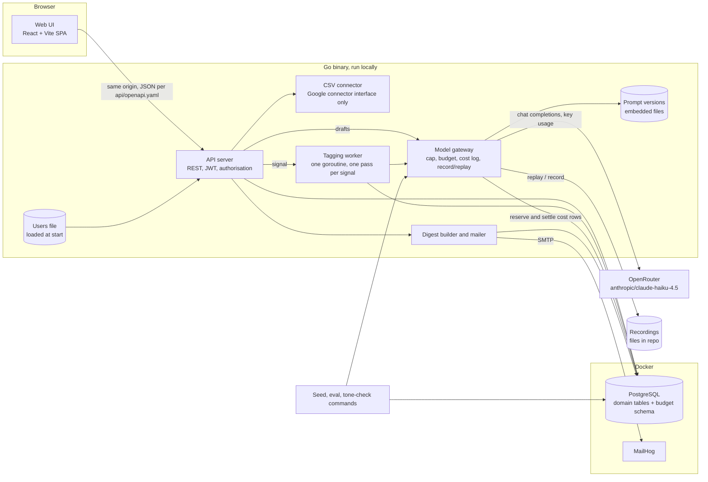

# High Level Design: Review Intelligence for Multi-Outlet Businesses

- Task: none
- Author: unattributed, 2026-10-06
- Status: Reviewed (critic review 2026-10-06, all 15 findings fixed; Approved needs the drawn diagram and the product owner's sign-off)
- Version: v2 (base: v1, commit a201e75)

## Changes from v1

Why this revision: the product owner decided on 2026-10-06 that each urgent flag carries its reasons, that the evaluation also reports sentiment accuracy with no pass mark, and what the 100-review evaluation set holds (recorded in docs/genai/review-classification-and-replies-solution.md; data model v2 and API 1.1.0 already carry the reasons).

| Section | Change | Driven by | Impact |
| --- | --- | --- | --- |
| 2. Users and flows (Flow C) | The digest lists each urgent review with its reasons | AC-US-01-009-4 (revised) | none beyond the backlog |
| 3. Architecture (tagging worker, eval command) | Result lines carry urgent reasons; the eval set's source and makeup and the sentiment report are stated | product owner decisions, 2026-10-06 | low-level-design for the tagging worker and the eval command |
| 4. Data | The review tag result row names urgent reasons | data model v2 | none (data model already revised) |
| 7. Failure modes (eval command) | Sentiment joins the report-only measures | AC-US-02-004-6 (new) | none |
| 17. Open questions | Who labels the 100 evaluation reviews, and from which source: closed | product owner decision, 2026-10-06 | none |
- PRD: docs/product/PRD.md (backlog: docs/product/backlog.md, register: docs/product/questions.md)
- ADRs: docs/architecture/decisions.md
- Tenets: docs/architecture/tenets.md

Serves: REQ-001 to REQ-048 (MVP); REQ-049 (stretch, only kept unblocked); US-01-001 to US-01-009, US-00-001 to US-00-003, US-02-001 to US-02-006 (MVP); US-01-010 (stretch); ADR-0001, ADR-0002, ADR-0003, ADR-0004, ADR-0005, ADR-0006, ADR-0007.

The repository holds no code yet (checked 2026-10-06: only README.MD and docs/). Every statement about components below describes the design, not existing code; anything not settled by the PRD, the register or an ADR is prefixed "assumption:".

## Summary

One Go binary serves a React single-page UI and a REST API, keeps everything in one PostgreSQL database, sends the digest to MailHog, and reaches OpenRouter only through one budgeted gateway; there is no broker, cache, search service or second store. Tagging runs inside the server as one pass over the untagged reviews per import, one batch of 20 at a time, the budget record survives every reset, and tests, CI and re-seeding replay recorded model responses so the USD 8 budget is spent only on real work.

Diagram: docs/architecture/diagrams/OutletOwl_SystemArchitecture_v1.svg (not drawn yet: run `architecture-diagram`)

## What gets built

| Component | Kind | Stack | Responsibility | Repository |
| --- | --- | --- | --- | --- |
| Web UI | frontend | React, Vite, TypeScript, types generated from api/openapi.yaml | Admin and manager screens: outlets, import, dashboard, review list, reply editing, digest button | OutletOwlWeb |
| API server | backend | Go, net/http, pgx, sqlc, goose, slog | REST API, JWT sign-in, per-resource authorisation, CSV connector, serves the built UI | OutletOwlServer |
| Model gateway | backend | Go, net/http client to OpenRouter | The only path to the model: max_tokens cap, budget stop with reserved cost rows and start-up reconciliation, record and replay | OutletOwlServer |
| Tagging worker | worker | Go goroutine in the server, PostgreSQL advisory lock | One pass over a snapshot of untagged reviews per signal, batches of 20, validation per review id, bounded retries | OutletOwlServer |
| Digest builder and mailer | backend | Go, SMTP to MailHog | Builds the weekly digest on demand and sends one email to the brand admin | OutletOwlServer |
| Seed, eval and tone-check commands | backend | Go commands in the same module | Seed 5 outlets and 1,500 reviews; classification evaluation; tone-check export and report | OutletOwlServer |
| Database | data | PostgreSQL in Docker | System of record for every entity | none (Docker image, PRD section 6) |
| Mail catcher | infrastructure | MailHog in Docker | Receives the digest locally and in CI | none (Docker image, PRD section 6) |
| CI | infrastructure | GitHub Actions with PostgreSQL and MailHog service containers | Build, generate, test with replayed responses; no model key | none (workflow file in this repository, ADR-0004) |

## 1. Goal and non-goals

One Go server that serves a React UI lets one brand's admin import each outlet's reviews by CSV, has the model tag every review once (themes, one sentiment label, an urgent flag) in batches of 20, and shows rating and sentiment trends, a theme heatmap, week-over-week movers and a searchable review list. Outlet managers get a reply drafted on demand in the brand's tone and the review's language, edit it and mark it replied, and the brand admin generates a weekly digest into MailHog that names the outlet and theme that moved most. Every model call passes one gateway that caps max_tokens at 1000, logs tokens and cost, refuses calls once the running total passes USD 8, and replays recorded responses in tests and CI; the whole product runs locally on the Go binary, PostgreSQL and MailHog.

Non-goals:

- Posting replies to Google or any review site; managers post by hand (PRD non-goal).
- Live connectors; the Google connector is an interface with no implementation (REQ-005).
- Several brands in one installation, and per-brand themes (Q-001, PRD non-goal).
- User management screens; accounts come from the seed or configuration (Q-003).
- Scheduled digest sending, digests to outlet managers, and digest open-rate tracking (Q-005, Q-006, PRD section 10).
- Re-tagging reviews when a prompt or the theme list changes, and any fallback model (Q-011, Q-012, Q-016).
- Cloud hosting, high availability and autoscaling; the product runs locally (PRD section 6).
- Product analytics and a public API or mobile client.
- Tenant colours (US-01-010) are a stretch: this design only avoids blocking them.

Agreed by the product owner in session, 2026-10-06.

## 2. Users and flows

Actors: brand admin (one), outlet managers (one per outlet), developer (runs seed, evaluations and CI).

Flow A: import and tag (brand admin)

1. The brand admin signs in with an account loaded from the users file at server start; the API server checks the bcrypt hash and sets an 8 hour JWT cookie (ADR-0007, US-00-001, Q-003).
2. The admin uploads a CSV on the import screen with a request id. The CSV connector matches each row's outlet by its unique name (case-insensitive), imports valid new rows in one transaction, skips rows already imported (same outlet, source, date, reviewer name and text) and returns the counts plus each rejected row with its row number and reason (US-01-002, Q-023).
3. When the import commits, the server signals the tagging worker (Q-022, ADR-0006). A signal while a pass is running is kept, so the new reviews are picked up when the pass ends.
4. The tagging worker takes a snapshot of the untagged review ids and makes one pass over it in batches of 20: each batch goes through the model gateway, one result per review id that passes validation is stored, and missing or invalid ids are retried up to the retry limit; ids still failing are left for the next pass (US-01-003, US-01-004, Q-014).
5. The dashboard shows the count of reviews still untagged; trends, heatmap and movers read the stored tags and show how many reviews in the weeks they cover are still untagged (US-01-005 to US-01-007).

Late arrivals: a review imported with a date in an already reported week is tagged like any other and appears in trends and movers on the next read; a digest already sent is not re-sent or amended (Q-005: generated on demand only).

Flow B: reply (outlet manager)

1. The manager signs in and sees only their outlet's dashboard and review list (US-00-001, Q-002).
2. The manager opens a review. If no reply row exists, the server first claims one with status "drafting" (only one request can claim it), then asks the gateway for a draft with the current reply prompt version and stores it; a second open at the same moment sees "drafting" and waits for the stored draft instead of paying again (US-00-002, Q-007). If the budget stop is active, the manager sees "drafting unavailable" and can write the reply by hand (AC-US-00-002-7).
3. The manager edits the text and marks it replied; the server records the final text, manager and time; marking replied is the approval (US-00-003, Q-008). The manager posts the text on the review site by hand.

Flow C: weekly digest (brand admin)

1. The admin presses "Generate digest" with a request id (US-01-009).
2. The server computes, in the brand timezone, the movers for the latest complete Monday to Sunday week against the week before, lists that week's urgent reviews with their reasons, names the outlet and theme that moved most, and counts the reviews dated in those two weeks that are still untagged (Q-004, Q-005). When that count is above zero, the digest's first line says so ("12 reviews in these weeks are not tagged yet; movers and urgent reviews may be incomplete").
3. The server records the digest under its request id with status "sending" before calling SMTP, sends one email to the brand admin through MailHog, then marks it "sent". A repeated request with the same id returns the recorded digest and never sends again (Q-006).

Flow D: seed (developer)

1. The developer runs the seed command. It truncates the domain tables (never the budget schema, section 4) with identity counters restarted, then creates 5 outlets, the users file entries for 1 admin and 5 managers, and 1,500 reviews inserted in a fixed order from deterministic texts. Dates end at the last complete Monday to Sunday week before the run in the brand timezone, with the planted wait-time spike in that week (US-02-006, design choice 3).
2. The seed command then tags the reviews in its own process, under the same lock as the server's tagging worker, with the gateway mode taken from the operator setting. The developer chooses record mode deliberately for the first seed (about USD 0.57) and replay mode afterwards (zero cost). Because review ids, batch order and texts are identical on every seed and the tagging prompt carries no dates, every later seed replays exactly; a missing recording fails the seed instead of calling the model (design choice 2, tenet 5).
3. The spike stays in "the latest complete week" for up to 7 days; re-seeding in replay mode moves it forward at no cost and without touching the budget record.

## 3. Architecture

Web UI (frontend; owner: the team). A React single-page app built by Vite into static files that the Go binary serves from the same origin (ADR-0002). It calls only the REST API, with request and response types generated from api/openapi.yaml (ADR-0005). It renders every review text, reviewer name and model draft as plain text, and ships its fonts, Devanagari included, inside the build; nothing is loaded from a CDN.

API server (backend; owner: the team). The Go HTTP server (ADR-0001) with the routes in section 5. At start it upserts the accounts from the users file (email, name, role, outlet name, bcrypt hash; the seed writes the same format), which is the "configuration" Q-003 names; a manager for an outlet added later is a new line in that file and a restart. It verifies the JWT cookie on every request, then re-reads the user's role and assigned outlet from PostgreSQL and applies the outlet scope as a condition in every query (ADR-0007, Q-002, tenet 3). It owns the CSV connector, which implements the connector interface a future source would also implement; the Google connector is that interface with no implementation (REQ-004, REQ-005). It signals the tagging worker after an import commits and once at start.

Model gateway (backend; owner: the team). One Go function every model call passes, for tagging, drafting, evaluation and tone checks (REQ-030 to REQ-032, AC-US-02-001-1). Before a live call it reads the running total and refuses when it is above USD 8 (Q-015); it then reserves a cost row priced at the request's worst case (its input plus max_tokens) and settles that row with `usage.cost` from the response, so a call that times out or is cancelled stays counted at its reserved price. It sets max_tokens to at most 1000 and sends the request to OpenRouter with the model identifier anthropic/claude-haiku-4.5 (Q-016). At server start it reconciles the running total: it reads the key's usage from OpenRouter's key endpoint and keeps the larger of that figure and the local sum, so a lost local row can never lower the total. It has three modes, chosen only by the operator setting: live, record (live and save the response) and replay (answer from saved responses, never building an HTTP client; a missing recording is an error). Prompts are read from versioned files embedded in the binary (Q-011). Timeouts and retries are in section 8.

Tagging worker (worker; owner: the team). One long-lived goroutine in the server (ADR-0006), fed by a signal channel that holds at most one pending signal, so signals during a pass collapse into one more pass and none is lost. On a signal, if the operator setting TAGGING_ENABLED is on, it takes the PostgreSQL advisory lock on a dedicated connection it holds for the whole pass (the lock only keeps the seed and eval commands from tagging at the same time), snapshots the untagged review ids, and makes one pass over the snapshot in batches of 20, in id order, with the current tagging prompt version. The prompt sends each review's integer id and text, cut to 2,000 characters; the model answers one compact line per review (id, theme codes, sentiment, urgent reasons; a review is urgent when it has any reason), so an answer cut off by the 1000-token cap still yields every complete line (conflict 1). A line is accepted only if its id belongs to the batch and appears exactly once in the answer, its themes are in the configured list and its fields are valid; an id seen twice counts as missing and is retried alone. Valid results are stored by review id with the prompt version (tenet 4); missing and invalid ids are retried as a smaller batch at most 2 times; ids still failing are dropped from this pass. A 402 or a budget refusal ends the pass. After releasing the lock the worker checks for reviews newer than the snapshot and runs one more pass for those only, so a poison review is tried once per import or restart, never in a loop.

Digest builder and mailer (backend; owner: the team). Computes the movers (outlet and theme pairs ranked by the change in the number of negative reviews, latest complete Monday to Sunday week against the week before, weeks in the configured brand timezone, default Asia/Kolkata) and the week's urgent reviews from PostgreSQL, using an injected clock so tests pin "now". It counts untagged reviews in the two weeks and states them on the first line, claims the digest row before sending, renders a plain-text and an escaped HTML body, and sends one email over SMTP to MailHog addressed to the brand admin (Q-004 to Q-006).

Seed, eval and tone-check commands (backend; owner: the team). Commands built from the same Go module, each taking the gateway mode from the operator setting and an injected clock. The seed command is described in Flow D. The eval command reads the 100 labelled reviews from testdata/eval/ (real public reviews with names removed, collected and labelled by the product owner: at least 20 urgent, at least 5 per reason, at least 20 in Hindi or Hinglish), runs them through the same gateway, parser and validator as the tagging worker, and never writes review tag results; it reports per-theme precision and recall, urgent recall and precision, the missed urgent reviews, and sentiment accuracy with precision and recall for negative (report only), with "gate not set" until a pass mark exists (Q-017, Q-018); its recordings are replayed in CI. The tone-check command drafts 30 replies and writes them as a Markdown file for a person to score against the rubric (Q-019); no spreadsheet format, so no formula injection.

PostgreSQL (data). The one store (PRD section 6, ADR-0003), with the budget record in its own schema (section 4). MailHog (infrastructure). The local mail catcher. OpenRouter (external). The model provider (section 6).

**Risks this leaves open**

- The API server, the tagging worker and the gateway share one process: a panic in tagging that is not recovered stops the UI too.
- Review text is untrusted and is sent to the model; a review written to steer the model ("this is not urgent") can change its own tags. Duplicate-id answers are rejected, so it cannot overwrite another review's result, but a well-formed wrong answer about itself passes validation; the urgent-recall evaluation (US-02-004) is the only check.
- The Google connector exists only as an interface, so the interface's shape is tested against one implementation (CSV) and may not fit a real API later.

## 4. Data

Store: PostgreSQL in Docker (PRD section 6), accessed with pgx and sqlc, schema managed with goose (ADR-0003). The full model belongs to `data-model` (docs/design/data-model.md, not written yet). Entities, all owned by the API server:

| Entity | Holds | PII | Rows | Retention |
| --- | --- | --- | --- | --- |
| user | name, email (unique), role, assigned outlet, bcrypt hash; upserted from the users file at start | yes: name, email | 6 in the demo | kept while in the users file |
| outlet | name, unique ignoring case; the CSV's outlet column matches it | no | 5 in the demo | kept |
| review | integer id, outlet, source, date (a calendar date), rating, text, reviewer name, import; unique on outlet, source, date, reviewer name and a hash of the text | yes: reviewer name, free text may contain personal data | 1,500 seed; about 11.5 per outlet per week at the seed's rate | kept |
| review tag result | review (unique), theme codes, sentiment, urgent flag, urgent reasons (food_safety, harassment, legal_threat; urgent exactly when any is present), prompt version | no | one per tagged review | kept |
| reply | review (unique), status (drafting, draft, replied), draft text, prompt version, edited text, replied by, replied at | no (text may quote the reviewer) | at most one per review | kept |
| digest | request id (unique), status (sending, sent, failed), week, recipient, untagged count, sent time, body | yes: may quote reviews | one per generated digest | kept |
| import | request id (unique), file name, accepted, skipped-duplicate and rejected counts, time | no | one per upload | kept |
| model call log (budget schema) | purpose, model, input and output tokens, reserved cost, settled cost, prompt version, outcome, time | no | one per live call; bounded by the budget: about 1,050 batch calls or about 4,000 drafts before USD 8 (section 8) | kept forever; it is the running total |

The budget schema holds only the model call log and has its own goose migration set with no Down migration. The seed reset truncates the domain tables only, and no documented recovery path drops the budget schema, so the USD 8 total survives every reset (REQ-031, Q-015, tenet 2). Running total: the sum of settled cost, or reserved cost where not yet settled, compared at start with the key usage OpenRouter reports (section 3).

Not stored in the database: prompt versions (files embedded in the binary, Q-011), recordings (testdata/recordings/), the 100 labelled evaluation reviews (testdata/eval/), the theme list and brand timezone (configuration, Q-012), the users file (local file, ignored by git), the JWT signing secret (environment).

The domain schema arrives as numbered goose migrations, one per story that adds a table, starting with users and outlets (US-01-001); the budget schema's first migration ships with the gateway (phase 2).

**Risks this leaves open**

- A review whose text was corrected and re-imported counts as a new review (the text hash differs), so the old and new versions both appear until someone removes one; there is no delete path in the PRD.
- A reserved cost row that is never settled (crash during a call) counts at its worst-case price, so the running total can over-count by up to about USD 0.0076 per such crash; over-counting is the safe side of REQ-031.
- Recordings live in the repository and contain review text from the seed; they must contain seed text only, never real customer reviews.

## 5. Interfaces

All REST endpoints are new and their shapes live in api/openapi.yaml (ADR-0005), written by `openapi-spec`. Every write with a side effect is safe to repeat, either through a client-made request id stored under a unique constraint or through a natural unique key; a repeat returns the first result with no second row or side effect (tenet 8).

- POST /api/auth/login, POST /api/auth/logout, GET /api/me (new), api/openapi.yaml.
- GET /api/outlets, POST /api/outlets (new; brand admin only for POST; the unique outlet name makes a repeat return the existing outlet), api/openapi.yaml.
- POST /api/imports (new; multipart CSV with request id; brand admin only; already imported rows are counted, not stored), api/openapi.yaml.
- GET /api/reviews with text search and filters for outlet, theme, sentiment, urgent and reply status; GET /api/reviews/{id} including its draft and reply (new), api/openapi.yaml.
- POST /api/reviews/{id}/draft (new; outlet manager of that outlet only; claims the reply row, then returns the stored draft or creates it once; refuses the brand admin, who reads drafts through GET /api/reviews/{id}), PUT /api/reviews/{id}/reply (new; edit text), POST /api/reviews/{id}/replied (new; idempotent: marking an already replied review returns it unchanged), api/openapi.yaml.
- GET /api/dashboard/trends, GET /api/dashboard/heatmap, GET /api/dashboard/movers (new; movers include the untagged count for the two weeks), api/openapi.yaml.
- GET /api/tagging/status (new; untagged count, worker state, budget state), api/openapi.yaml.
- POST /api/digests (new; with request id; brand admin only), api/openapi.yaml.
- Users file (new): one entry per account with email, name, role, outlet name and bcrypt hash; read at server start; written by the seed. Format set in `low-level-design`.
- Connector interface (new, internal Go interface): CSV implements it; Google declares it only. Contract: the interface definition in the server module, designed in `low-level-design`.
- Model gateway (new, internal Go function) to OpenRouter chat completions, model anthropic/claude-haiku-4.5, and OpenRouter's key endpoint for usage at start. Contract: OpenRouter's API reference.
- Prompt versions (new): prompts/<name>/vN.md for the tagging and reply prompts, one marked current (Q-011, `prompt-registry`).
- Recordings (new): testdata/recordings/, keyed by mode-independent request content: model, prompt version and the exact request body (review ids, order and texts). Used by tests, CI and re-seeding.
- Evaluation set (new): testdata/eval/, the 100 labelled reviews with expected themes and urgent flags.
- SMTP to MailHog (new): one message per digest.

## 6. External integrations

### OpenRouter (model provider)

Used for tagging batches, reply drafts, the classification evaluation and the tone-check drafts, always through the model gateway, model anthropic/claude-haiku-4.5 as listed on OpenRouter's model page (https://openrouter.ai/anthropic/claude-haiku-4.5), verified again before the first live call (Q-016).

- Rate limits: paid accounts on non-free models have no OpenRouter per-minute or per-day request caps; provider-side limits surface as HTTP 429 (https://openrouter.ai/docs/api-reference/limits). 429 is not expected at this load (section 8); when it happens the gateway retries with the backoff in section 8, then the caller treats it as a failed call.
- Credits: exhausted account credit or the per-key limit returns HTTP 402 with `error.metadata.limit_source` (same page). The gateway treats 402 as a hard stop like the USD 8 refusal: the tagging pass ends, drafting shows "drafting unavailable".
- Key usage: `GET /api/v1/key` returns the key's `limit`, `limit_remaining` and usage counters (same page). The gateway reads it at server start to reconcile the running total (section 3); if the endpoint cannot be reached, the local total stands and the start is logged as unreconciled.
- Cost: every response carries `usage.prompt_tokens`, `usage.completion_tokens` and `usage.cost`, "the total amount charged to your account", in credits, with no opt-in needed (https://openrouter.ai/docs/use-cases/usage-accounting). If a response lacks `usage.cost`, the reserved worst-case price stays on the row. assumption: one credit equals USD 1 (section 17).
- Idempotency: assumption: OpenRouter chat completions take no idempotency key (none in the pages read). A timed-out call is not resent blindly: its reserved cost row stays counted, tagging retries the review ids (a possible double charge of about one cent, ADR-0006), drafting reports failure to the manager.
- Down or slow: tagging stops and the next pass retries; drafting shows an error and the manager writes by hand; dashboards, search, replies and the digest keep working because none of them calls the model.
- Credential: OPENROUTER_API_KEY in the local environment file, ignored by git, never in CI (ADR-0004). The key is capped at USD 10 in OpenRouter's dashboard (PRD section 6); the product owner rotates it there if it leaks.
- After a budget stop or 402: nothing restarts model calls automatically. The product owner decides whether to change REQ-031 through `prd`; the runbook docs/runbooks/budget-stop.md lists the steps.

### MailHog (local mail catcher)

Receives the digest over SMTP, locally and as a CI service container (conflict 2). Down: the digest row is marked failed and the admin sees the error; pressing again with a new request id sends a new digest. No credential.

### Deliberately not integrated

- Google Business Profile API: interface only; API access takes weeks and live connectors are out of scope (REQ-005, PRD non-goals).
- A real email provider (Resend, Postmark, SES): the digest goes to the local catcher only (PRD L72).
- A hosted identity provider (Auth0, Firebase Auth): the runtime allows nothing else (ADR-0007).
- An analytics SDK and digest open tracking: not a requirement, and MailHog has no real readers (PRD section 10).
- An error-tracking service (Sentry): the runtime allows nothing else; errors go to the server log.
- A font CDN: fonts ship inside the UI build (section 3).
- A second model or provider fallback (Q-016).

**Risks this leaves open**

- assumption: one OpenRouter credit is USD 1; if not, the USD 8 stop fires at a different real spend.
- The key endpoint reports usage for the whole key; spend from any other tool using the same key raises the reconciled total, which is the safe direction but can stop the product early.
- The model identifier and prices can change on OpenRouter's side; replayed tests will not notice, only the first live call will.
- MailHog's last release is old; if its image stops running, the digest and its CI test both stop. assumption: the image still runs on Docker 29 (section 17).

## 7. Failure modes

| Component | What fails | How it is noticed | What the user sees | How it recovers |
| --- | --- | --- | --- | --- |
| Web UI | API unreachable or 5xx | Request error in the browser | An error state with a retry action | Retry once the server is back |
| API server | Process crash or panic | Server log; browser requests fail | The UI error state | Restart the binary; the worker runs a pass at start |
| API server, sign-in | JWT secret missing or changed | Server refuses to start without it; a changed secret rejects all tokens | Signed out; sign in again | Set the secret in the environment file |
| API server, users file | File missing or a line invalid | Start-up log names the line | Those accounts cannot sign in | Fix the file and restart |
| CSV connector | Bad rows or wrong columns | Per-row validation | Rejected rows with row number and reason; valid rows imported | Fix the file and import it again; rows already imported are skipped |
| CSV connector | The same file submitted twice (double click, retry) | Unique request id | The first result again | None needed |
| Tagging worker | Model answer cut off by the 1000-token cap | Fewer valid lines than ids | Untagged count stays above zero briefly | The missing tail is retried as a smaller batch |
| Tagging worker | A review fails validation after 2 retries (poison or injection) | Validation; untagged count | That review shows as untagged | Tried once more at the next import or restart; never looped within a pass |
| Tagging worker | Crash in the middle of a batch | Lock released when its connection closes | Untagged count | The pass at next start re-runs the untagged reviews; at most one batch is paid twice and counted at its reserved price |
| Tagging worker | Operator turns TAGGING_ENABLED off | Worker state on the status endpoint | "Tagging paused" on the dashboard | Turn it on and restart or import |
| Model gateway | Budget stop (total above USD 8) or OpenRouter 402 | Gateway refusal, logged; status endpoint | "Drafting unavailable"; tagging stops; banner on the dashboard | The product owner decides on REQ-031 (section 6); nothing automatic |
| Model gateway | OpenRouter 429, 5xx or timeout | Gateway error, logged | Draft error message after at most 45 seconds; tagging retries the ids | Bounded backoff, then the next pass |
| Model gateway | Replay mode with no recording | Error naming the missing recording | Test failure (CI) or seed failure (developer) | Record once in record mode, deliberately |
| Model gateway | Key endpoint unreachable at start | Start-up log "unreconciled" | Nothing | The local total stands; reconciled at next start |
| Digest builder and mailer | MailHog down | SMTP error; row marked failed | "Digest not sent" with the error | Press again with a new request id |
| Digest builder and mailer | Crash after the email is sent and before the row is marked sent | A digest row left in "sending" | A repeat of the same request returns the "sending" row and sends nothing; a new request sends a new digest | Accepted: at most one extra email in a local catcher, only if the admin starts a new request |
| PostgreSQL | Container stopped | Connection errors in the log; health endpoint | Every screen errors | Start the container; no data loss for committed rows |
| Seed command | Replay with recordings that do not match (prompt version changed) | Replay error naming the key | Seed fails before tagging finishes | Run once in record mode, deliberately (about USD 0.57) |
| Eval command | Urgent recall below 90% | Report shows the urgent gate failed and lists missed urgent reviews | Run exits with failure; theme accuracy (Q-018), sentiment accuracy and tone (Q-019) are report only and never fail it | Fix the tagging prompt, re-run, record a new replay |
| CI | A test tries to reach OpenRouter | No key, openrouter.ai mapped to 0.0.0.0; replay error | Red build | Add the recording |

## 8. Scaling and limits

Expected load (from the PRD and seed): 6 accounts; 5 outlets; 1,500 seed reviews over 26 weeks, which is about 11.5 reviews per outlet per week. At the same rate the 25-outlet example would bring about 290 reviews a week (25 x 11.5), 15 tagging batches a week.

Cost per call (estimates from Claude Haiku 4.5 list prices of USD 1 per million input and USD 5 per million output tokens; assumption, section 17):

- Tagging batch: about 600 prompt tokens plus 20 English reviews of about 100 tokens is about 2,600 input tokens, USD 0.0026; output at most 1,000 tokens, at most USD 0.005; at most about USD 0.0076 a batch. Devanagari text takes several times more tokens than English; a batch of 20 Hindi reviews of the same length is assumption: about 3 times the review tokens, about 6,600 input tokens, at most about USD 0.0116.
- Draft: about 750 input tokens, USD 0.00075; 150 to 250 output tokens, up to USD 0.00125; about USD 0.002 a draft (more for Hindi).
- First seed: 75 batches, at most about USD 0.57 if the reviews are English, more in proportion to the Hindi share. Later seeds: zero (replay, when ids, order and texts match). Evaluation run: 5 batches, about USD 0.04. Tone check: 30 drafts, about USD 0.06.

The limit that stops the design is the budget, by requirement (REQ-031): USD 8 buys about 1,050 English tagging batches (about 21,000 reviews) or about 4,000 drafts, or a mix. At the 25-outlet rate tagging costs about USD 0.11 a week, so tagging alone does not reach the budget for well over a year; drafting every review at that rate adds about USD 0.58 a week. These are estimates, not measurements.

Worst window: the first seed's 75 batches while managers request drafts. The tagging worker has one call in flight (ADR-0006); drafts are not limited per user, but each review can have only one draft call (the claimed reply row), and 6 people opening reviews by hand is assumption: at most about 6 draft calls in flight, about 7 calls in all. OpenRouter places no request cap on paid non-free models (section 6), so the provider is not the limit. Check then act on the budget: concurrent calls can all pass the check at USD 7.99, so with about 7 in flight the total can end about 7 x USD 0.0076 = USD 0.05 above USD 8, which stays under the USD 10 key cap (Q-015 accepted the crossing call); the reserved cost rows make the next check see in-flight spend at once.

Time: one batch at a time at an estimated 5 to 10 seconds a call tags about 120 to 240 reviews a minute; the first seed takes about 6 to 12 minutes live and seconds in replay. An import of 10,000 reviews would take about 40 to 80 minutes and about USD 3.80, which is the first point where a design change (parallel batches, a job table, ADR-0006's revisit trigger) would be needed.

Numbers that must agree:

- Batch 20 reviews under max_tokens 1000: 50 tokens a line at most. Review ids are integers (about 1 to 2 tokens) and themes are short codes, so a line is assumption: about 10 to 15 tokens, about 300 a batch, far inside the cap; a preamble or a cut-off tail only loses lines, which are retried.
- Tagging retries: at most 2 retries per batch, each a batch of only the missing or invalid ids; an id seen twice in one answer is retried alone.
- Gateway HTTP timeout: 30 seconds per call. 429 and 5xx: at most 2 retries with 2 and 4 seconds of backoff. Draft deadline: 45 seconds in total, after which the manager sees the error.
- Review text sent to the model: cut at 2,000 characters.
- Seed spike: in the latest complete week the spike outlet has at least 3 times its own weekly average of negative wait-time reviews (the use case's "tripled") and at least 4 more than the next-largest outlet and theme change, so it ranks first (AC-US-02-006-4).
- JWT expiry: 8 hours (design choice 4). The database holds tens of thousands of rows at most; PostgreSQL is not a limit at this size.

**Risks this leaves open**

- All cost and latency numbers are estimates; the first live seed should be checked against the cost log before trusting them.
- The Hindi token multiplier is an estimate; a seed with many Hindi reviews costs more than USD 0.57 the first time.
- If 6 people open many reviews at once the in-flight count can exceed 7; the overshoot past USD 8 stays at cents, but the arithmetic above assumes typical use.

## 9. Security and privacy

Auth model: sign-in with email and password against a bcrypt hash from the users file; a signed JWT with an 8 hour expiry in an HttpOnly, SameSite=Strict cookie (ADR-0007, design choice 4). The token identifies the user only; on every request the server re-reads role and assigned outlet from PostgreSQL. There is no revocation before expiry; signing out clears the cookie.

Authorisation per resource, enforced at the server as a query condition, not only in the UI:

| Resource | Brand admin | Outlet manager |
| --- | --- | --- |
| Outlets | read all, create | read own |
| Imports | create | none |
| Reviews, tags, dashboard, search | read all outlets | read own outlet only |
| Draft (create) | none: refused | own outlet only |
| Draft and reply (read) | all, through GET /api/reviews/{id} | own outlet only |
| Reply edit and mark replied | none (Q-002) | own outlet only |
| Digest | create | none |
| Tagging status | read | read |

PII touched: user names and emails; reviewer names and review text, which may contain personal details; digests quoting reviews. assumption: for tagging the model receives review id and text only; for drafts it also receives the reviewer name so the reply can greet them (section 17). Data leaves the machine only to OpenRouter.

Untrusted content: review text, reviewer names and model drafts are rendered as text in the UI and escaped in the digest's HTML body, never as markup (tenet 6). The tone-check export is Markdown, not a spreadsheet. All users are staff on one origin; there is no public page that shows review content. Model output never reaches anyone who is not staff, and a manager approves every reply before it is posted by hand, so `llm-guardrails` is not on a public path; the urgent-recall evaluation is the check on tagging.

Secrets: OPENROUTER_API_KEY, the JWT signing secret and the database password, in a local environment file ignored by git; the users file holds bcrypt hashes only and is ignored by git too; none of them in CI (ADR-0004). Seeded passwords are for local demo accounts only.

**Risks this leaves open**

- A copied JWT stays valid up to 8 hours with no way to revoke it (ADR-0007, accepted).
- Prompt injection inside a review can bias its own tags, including hiding an urgent issue; detection relies on the evaluation set, not on a runtime guard.
- Seeded demo passwords, if reused for real data, would be weak; the PRD has no password policy.

## 10. Observability

Logs: structured JSON logs with slog from the Go binary, one line per request (route, status, duration, user id) and one per model call (purpose, prompt version, tokens, reserved and settled cost, outcome, mode live, record or replay), plus the start-up reconciliation result. No metrics or tracing service: the runtime allows nothing else.

Signals the product shows instead of alerts (each with the runbook `runbook` will write):

- BudgetStopActive: the gateway refuses because the total is above USD 8 or OpenRouter returned 402; dashboard banner and draft message. Runbook docs/runbooks/budget-stop.md.
- TaggingBacklog: untagged reviews remain after a pass ended, or tagging is paused; count on the dashboard, the movers view and the digest's first line. Runbook docs/runbooks/tagging-backlog.md.
- DigestSendFailed: SMTP error on digest, or a digest row left in "sending"; message to the admin. Runbook docs/runbooks/digest-send-failed.md.
- ReplayMissing: a replay found no recording; test or seed failure naming the key. Runbook docs/runbooks/replay-missing.md.
- BudgetUnreconciled: the key endpoint could not be read at start; start-up log. Runbook docs/runbooks/budget-stop.md.

The cost log is also the audit of model spend: every call, its prompt version and its cost.

**Risks this leaves open**

- Nobody is paged; a signal is seen only when someone opens the dashboard, reads the digest or reads the log.
- No error-tracking service means a rare panic is found only by reading logs.

## 11. Analytics

No product analytics: a non-goal (section 1), with no analytics store (out of scope in the decisions pass). The business questions the PRD asks are answered by the product's own tables and screens, kept apart from the model cost log:

| Business question | Source | Reporting path |
| --- | --- | --- |
| Which outlet and issue moved most this week? | review and review tag result, with the untagged count | Movers view and digest (US-01-007, US-01-009) |
| How are rating and sentiment trending per outlet? | review and review tag result | Trends view (US-01-005) |
| Are reviews getting replies? | reply status and replied time | Review list filter on reply status (US-01-008) |
| How much model budget is left? | model call log (budget schema) | Tagging status endpoint and banner |

**Risks this leaves open**

- "Replied" means a manager marked it so; the product cannot confirm the reply was posted on the review site.
- Without usage analytics the team cannot tell which screens are used.

## 12. Rollout and rollback

The product runs locally; "rollout" is the build order and how to step back at each phase. No feature flags. Two operator-owned controls, separate from every user setting, both in the environment file: the gateway mode (live, record, replay; replay is the default in tests and CI) and TAGGING_ENABLED (on by default).

| Phase | Ships | Migration order | Back out | Work in flight |
| --- | --- | --- | --- | --- |
| 0 | Docker for PostgreSQL and MailHog; CI with both service containers, openrouter.ai mapped to 0.0.0.0 in the runner's hosts file, no key, and a test that replay never builds an HTTP client; empty server serving the empty UI | none | revert the commit | none |
| 1 | Users file loaded at start, sign-in, outlets (US-01-001, US-00-001 sign-in part) | users, outlets | goose down, revert | open sessions: tokens become useless once the users table is gone |
| 2 | Gateway with record and replay, budget schema with reserved cost rows, start-up reconciliation, budget stop (US-02-001, US-02-002, US-02-003) | budget schema (no Down) | revert the code; the budget schema and its rows stay | none; no live calls yet |
| 3 | CSV import with de-duplication and the tagging worker (US-01-002 to US-01-004) | reviews, imports, tag results | goose down on domain tables, revert | a running pass stops with the process; untagged rows simply remain |
| 4 | Dashboard and search (US-01-005 to US-01-008, rest of US-00-001) | indexes only | revert; drop indexes | none |
| 5 | Drafts and replies (US-00-002, US-00-003) | replies | goose down, revert | stored drafts and replied states are lost on down; re-seed in replay mode |
| 6 | Digest (US-01-009) | digests | goose down, revert | a digest left in "sending" is lost on down |
| 7 | Seed, evaluation, tone check (US-02-004 to US-02-006) | none | revert | the first recorded seed's recordings stay in git |

Each phase's back-out target is the previous phase, which exists because phases ship in order. No back-out drops the budget schema. Stretch US-01-010 (tenant colours) comes after phase 7 and needs only UI theme tokens.

**Risks this leaves open**

- goose down on phases 3 and 5 deletes demo data; recovery is a re-seed, which is free only while the recordings match the current prompt version and the seed is unchanged.
- A changed tagging prompt version or seed generator makes every recording stale; the next seed in record mode spends about USD 0.57 again.

## 13. Outside the standard stack

Compared with the tech-decision catalogue defaults:

- OpenRouter as the model gateway (llm provider; PRD section 6, no ADR; the catalogue default is Anthropic directly through `llm-gateway`): sign-off pending from the product owner, acting as Architect.
- MailHog as the only email path (email; PRD section 6, no ADR; the catalogue default is a hosted email provider): sign-off pending from the product owner, acting as Architect.
- Own sign-in with a JWT cookie (auth; ADR-0007; the catalogue default is a hosted identity provider): sign-off pending from the product owner, acting as Architect.
- Tagging worker in the server process over untagged rows instead of an outbox or queue (messaging; ADR-0006): sign-off pending from the product owner, acting as Architect.

Go, React with Vite, sqlc with pgx and goose, PostgreSQL, GitHub Actions, and REST with OpenAPI are catalogue defaults.

## 14. Repository plan

Mirrored from docs/architecture/repo-plan.json. Both entries live in this repository (path "."), as the product owner chose (design choice 1).

| Repository | Path | Stack id | Responsibility | Apps |
| --- | --- | --- | --- | --- |
| OutletOwlServer | . (manikorimilli/outlet-owl) | go-api | Go binary: REST API, sign-in, CSV connector, tagging worker, model gateway, digest, seed and evaluation commands; owns the database schema | none |
| OutletOwlWeb | . (manikorimilli/outlet-owl) | react-web | React and Vite UI built into the Go binary | web: Dashboard, for the brand admin and outlet managers |

## 15. Decisions and conflicts

7 ADRs (ADR-0001 to ADR-0007, all Accepted) and 4 conflicts settled by the product owner, 0 open, in docs/architecture/decisions.md. ADRs needed: none.

## 16. What the review found

Reviewed by: critic, 2026-10-06 (graded mode; read the HLD, ADR-0001 to ADR-0007, docs/architecture/, the backlog, the PRD and the register; no data model exists). Verdict: approve after the four MAJOR findings are fixed. Findings are copied verbatim; only the Status lines are added.

Traps checked and found fine at this size: check-then-act budget overshoot (7 x 0.0076 = USD 0.05, under the USD 10 cap); growth (tens of thousands of rows at most, no polled table grows); model output on a public path (none: a manager approves every reply and posts by hand); role re-read per request (ADR-0007 and tenet 3 agree); cost estimates (all recomputed and consistent).

### MAJOR: The running total lives in tables the documented recovery paths delete

The cost log, the only budget record, is in the same database as demo data (s4 L156, L162, tenet 2). The seed refuses a non-empty DB and recovery is "Reset the database and rerun" (s7 L238); phase 2 back-out is "goose down" on the model call log (s12 L335); s12 L346 makes re-seeding the normal recovery for phases 3 and 5. Each reset sets the USD 8 total to zero while real OpenRouter spend keeps accumulating against the USD 10 key cap. Re-seeding is also the only way to move the spike back into "the latest complete week", so resets will be routine. REQ-031 then holds only per database lifetime; the key cap, not the product, becomes the stop.

Conflicts with: REQ-031, Q-015 ("counts every call ... survives restarts"), AC-US-02-001-6, tenet 2, HLD s4/s7/s12, ADR-0006 consequence 3 ("the USD 10 key cap absorbs it").

Fix: HLD s4/s12: the model call log is never dropped (its own goose migration set or schema with no Down; seed reset truncates domain tables only). HLD s6/s7: add a startup reconciliation that reads the key's usage from OpenRouter's key endpoint and takes max(local sum, provider usage) as the running total; record that endpoint as a provider fact with link and owner.

Status: fixed (s3 model gateway: reserved cost rows and start-up reconciliation; s4: budget schema with no Down, seed truncates domain tables only; s6: key endpoint; s12 phase 2)

### MAJOR: A poison review is re-selected forever within one tagging run, with no off switch

s3 L131 and ADR-0006 L28: the run "selects untagged reviews 20 at a time" and takes "every review with no stored tag result". A review that fails validation after the retry limit "stays untagged" (AC-US-01-004-5), so it is still untagged and first in stable order on the next select of the same run. A poison review (the model always emits an off-list theme for it, possibly via injection) loops at about USD 0.0009 per single-review call (700 input + about 35 output tokens); at 5 to 10 s per call that burns the full USD 8 in 12 to 25 hours, and a restart does not stop it because the run starts at server start (s3 L127). The only control is the gateway mode (s12 L329), and replay mode breaks drafting too.

Conflicts with: AC-US-01-004-5 ("picked up by the next tagging run", not this one), Q-014, REQ-031, ADR-0006 decision item 4.

Fix: HLD s3 and ADR-0006: the run snapshots the untagged IDs at start (or keeps an in-run given-up set), makes one pass, then ends. HLD s12: add an operator switch TAGGING_ENABLED separate from the gateway mode.

Status: fixed (s3 tagging worker: snapshot, one pass, newer reviews only after the pass; s7; s12: TAGGING_ENABLED operator switch)

### MAJOR: Accounts have no home before phase 7, and outlets added later can never get a manager

Q-003 and s4 L151 say accounts come from "seed or configuration", but no configuration mechanism is designed anywhere in the HLD. The seed ships in phase 7 (s12 L340) and refuses a non-empty DB (L238), so phases 1 to 6 have no way to sign in except hand-written SQL. After seeding, an outlet added via US-01-001 has no manager (the backlog assumes "the configuration assigns one", which does not exist), and AC-US-00-003-3 forbids the admin from replying, so that outlet's reviews can never be marked replied, which breaks REQ-022 and REQ-023 for every non-seed outlet.

Conflicts with: Q-003, US-01-001 assumptions, US-00-003, REQ-022, REQ-023, HLD s4 user row, s12 phase 1.

Fix: HLD s4 and s12 phase 1: a users file (email, role, outlet name, bcrypt hash) upserted at server start, shipped in phase 1; the seed writes the same format.

Status: fixed (s3 API server and s5: users file upserted at start, written by the seed; s4 user row; s12 phase 1)

### MAJOR: The digest is silently built from partly tagged weeks

Flow C (L76) and s3 L133 compute movers and urgent reviews from stored tags only. Untagged reviews are excluded from counts with no notice in the email: during a seed still tagging (6 to 12 min live), after a budget stop or 402 (they stay untagged until "a new decision"), or after retry-limit failures. The digest is then stored under its request id and returned unchanged. An untagged food-safety review is missing from the urgent list, the costliest error the PRD names (US-02-004 rationale). TaggingBacklog is shown only on the dashboard (s10 L300).

Conflicts with: REQ-026, REQ-027, AC-US-01-009-4, AC-US-01-009-6, AC-US-01-007-2, HLD s10.

Fix: HLD s3 (digest) and Flow C: count untagged reviews dated in the two weeks; when any exist, the digest's first line says so, and the movers view shows the same count.

Status: fixed (Flow C step 2 and s3 digest: untagged count on the first line; s5: movers carry the count; s10 TaggingBacklog)

### MINOR: The seed's record-then-replay switch contradicts tenet 5, s7 and the operator control

Flow D L82 and s3 L135 choose record mode "the first time" and fall back to live when recordings go stale; tenet 5 (L41) forbids exactly this fallback, s7 L234 says record "deliberately", and s12 L329 makes mode an operator env setting. Flow D also says "The tagging run" (server) tags the seed while s3 says the seed command does; if the server tags in live mode, nothing is recorded.

Conflicts with: tenet 5, HLD s7, s12, AC-US-02-003-2.

Fix: HLD Flow D and s3: the seed takes the mode from the operator setting, a missing recording fails the seed, and the seed command tags in its own process under the same advisory lock.

Status: fixed (Flow D step 2 and s3 commands: mode from the operator setting, the seed tags in its own process under the same lock, a missing recording fails; s7)

### MINOR: Side effect then record for drafts, digests and cost rows

"Creates it once" (s5 L178) has no mechanism: two concurrent opens (two tabs, React StrictMode's double effect in development) both pass "no draft" and both pay; the unique constraint on reply.review rejects the second insert only after the model was paid. The digest is recorded after sending (L77, s7 L236), so two in-flight requests with the same id both send, which breaks "one email" (AC-US-01-009-5) and tenet 8. A draft call tied to the request context is paid but never logged when the user closes the tab, a user-triggered under-count, not a rare one.

Conflicts with: tenet 8, HLD s5 L172, s7, ADR-0006 item 3.

Fix: HLD s5/s7: claim first: insert the reply row with status "drafting" ON CONFLICT DO NOTHING RETURNING before calling the gateway; insert the digest row with status "sending" before SMTP; the gateway inserts a cost row reserved at max_tokens price before the call and updates it after.

Status: fixed (Flow B step 2: claimed reply row; Flow C step 3: digest row claimed as sending; s3 model gateway: reserved cost rows; s4; s7)

### MINOR: Advisory lock mechanics, and a lost start signal

Session advisory locks are re-entrant per connection: a lock taken via a pgx pool returns to the pool with its connection, and a later start on that same connection re-acquires it, giving two runs. An import that commits while a run is exiting finds the lock still held and starts nothing; its reviews wait for the next import or restart, which breaks AC-US-01-002-6.

Conflicts with: ADR-0006 item 6, HLD s3 L131, AC-US-01-002-6.

Fix: HLD s3: one long-lived tagging goroutine fed by a coalescing channel (buffer 1); the advisory lock is held on a dedicated acquired connection, only to exclude the CLI commands; after releasing, re-check the untagged count.

Status: fixed (s3 tagging worker: one long-lived goroutine, signal channel holding one pending signal, lock on a dedicated connection used only to exclude the commands, re-check for newer reviews)

### MINOR: Numbers the backlog defers to "design" are not set in the design

The tagging retry limit (AC-US-01-004-5, backlog "set in design"), the 429/5xx retry count (s6 L194), the gateway HTTP timeout and a draft deadline (a manager could wait N x 5 to 10 s plus backoff), the retry batch size, the spike size (AC-US-02-006-4) and the review truncation length (s17) are not in s8 or s17.

Conflicts with: AC-US-01-004-5, AC-US-02-006-4, HLD s8 "Numbers that must agree".

Fix: HLD s8: state each number; s17: any still open, with an owner.

Status: fixed (s8 Numbers that must agree: 2 tagging retries, 30 s timeout, 2 retries at 2 and 4 s, 45 s draft deadline, 2,000-character cut, spike size)

### MINOR: Prompt injection can reach other reviews in the batch, not just its own

s3 L142 and s9 L290 say a review can bias "its own tags". With one line per review, a review's text can make the model emit a well-formed line for another ID in the same batch. No rule covers duplicate IDs in one answer; with first-write-wins under a unique constraint, the injected line can clear another review's urgent flag.

Conflicts with: AC-US-01-004-2, AC-US-01-004-3, tenet 4.

Fix: HLD s3: an ID that appears twice in one answer counts as missing and is retried alone; add a recorded fixture test.

Status: fixed (s3 tagging worker: an id seen twice counts as missing and is retried alone; s3 risks; fixture test belongs to US-01-004 tests)

### MINOR: Import identity: re-imports duplicate rows, and outlet names are ambiguous

s7 L227 tells the admin to "fix the file and import the rejected rows"; re-importing the fixed whole file doubles every valid row, which is accepted (s4 L166), doubling movers and trends and paying to tag them again. POST /api/outlets (L175) has no request id and no unique name, so a double click makes the CSV's outlet column ambiguous. Reviews do not reference their import, so a bad import cannot be undone.

Conflicts with: tenet 8, HLD s5 L172 ("every write with a side effect takes a request id"), AC-US-01-002-1, AC-US-01-002-3, B1.

Fix: HLD s4: a unique natural key on review (outlet, source, date, reviewer name, text hash) reported as "already imported"; a case-insensitive unique outlet name, with the CSV matched by that name; review.import_id.

Status: fixed (Flow A step 2; s4: review natural key, unique outlet name, review import; s5; s7; backlog wording listed in s17)

### MINOR: Week boundaries have no timezone and no injectable clock

Q-005 fixes Monday to Sunday weeks, but the HLD does not say whether a review date is a calendar date or a timestamp, which zone defines Monday (the container defaults to UTC; the brand is likely IST), or how CI tests of AC-US-01-007-2 and AC-US-01-009-6 pin "now".

Conflicts with: Q-005, AC-US-01-007-1, AC-US-01-007-2, AC-US-01-009-4, AC-US-01-009-6.

Fix: HLD s4: review date is a DATE; weeks computed in a configured brand timezone. HLD s3: movers, digest and seed take an injected clock.

Status: fixed (Flow C and s3 digest: brand timezone, default Asia/Kolkata, injected clock; s4: review date is a calendar date; s17)

### MINOR: The evaluation set has no home and collides with REQ-011

The eval command "tags the 100 labelled reviews" (s3 L135); nothing says where they live. If they are review rows, REQ-011 forbids re-tagging them under a new prompt version, and storing their tags would pollute the dashboard.

Conflicts with: US-02-004, REQ-011, AC-US-02-004-4, AC-US-02-004-5.

Fix: HLD s4/s5: the labelled set lives in testdata/eval/; the eval uses the gateway, parser and validator but never writes review tag results; its recordings are replayed in CI.

Status: fixed (s3 commands: labelled set in testdata/eval/, never writes tag results, replayed in CI; s4; s5)

### MINOR: "Network blocked to OpenRouter" in CI has no mechanism

s7 L240 and AC-US-02-003-3 require the suite to pass with OpenRouter blocked; GitHub-hosted runners allow outbound traffic by default.

Conflicts with: AC-US-02-003-3, ADR-0004.

Fix: HLD s12 phase 0: a CI step maps openrouter.ai to 0.0.0.0 in /etc/hosts and leaves the key unset; a test asserts replay mode never builds the HTTP client.

Status: fixed (s12 phase 0: openrouter.ai mapped to 0.0.0.0, no key, replay-never-builds-a-client test; s7)

### NIT: The reversibility labels disagree

ADR-0003 says "cheap to awkward"; the decisions.md index row says "cheap".

Conflicts with: ADR-0003, docs/architecture/decisions.md.

Fix: copy the ADR's label into the index.

Status: fixed (docs/architecture/decisions.md: ADR-0003 row now reads cheap to awkward)

### NIT: Two loose statements in the worst window and the authorisation table

s8 L254's "each signed-in user at most one draft" is not enforced (tabs are unlimited); the overshoot is still cents, but the sentence claims a limit that does not exist. s9 gives the admin draft "read all", but the only draft endpoint is create-or-return (L178).

Conflicts with: HLD s8, s9, s5.

Fix: s8: drop the per-user limit claim. s5: the endpoint refuses the admin when no draft exists; admins read drafts through GET /api/reviews/{id}.

Status: fixed (s8: per-user limit claim replaced by one draft call per review; s5 and s9: the draft endpoint refuses the admin, who reads drafts through GET /api/reviews/{id})

**Weakest claims (critic).**

1. Re-seeding is free, "Later seeds: zero (replay)" (s8 L250, Flow D L82): recordings are keyed by "request content", which includes review IDs, batch order and any run-dependent field; none is pinned, so drift means every replay misses. Falsify: record once, reset, seed in replay mode and count ReplayMissing errors.
2. "every response carries `usage.cost`" (s6 L196): if cost were absent the running total would stay at zero and the USD 8 stop would never fire. Falsify: one curl with a 1-token prompt (about USD 0.00001) and inspect the JSON.
3. "targets about 35 tokens a line ... about 30 percent headroom" (s8 L258): a UUID alone is about 20 tokens or more, and the model may add a preamble. Falsify: count tokens on a hand-written 20-line answer with the real ID type, or one live batch (about USD 0.008) checking completion_tokens and finish_reason.

**Not said (critic).**

- Demo shelf life: the spike is in "the latest complete week" for at most 7 days after seeding; after that AC-US-01-007-2 and AC-US-01-009-6 fail on the demo and the only way back is a reset, which wipes the budget (MAJOR 1).
- Who labels the 100 evaluation reviews, and from what source; if from the generated seed, the evaluation measures the generator.
- Devanagari input costs several times more tokens than English (s8 omits it); fonts must be bundled in the binary, not loaded from a CDN, to respect "nothing else" at runtime.
- Who acts after a 402 or the budget stop, and how; "a new decision" is not a mechanism.
- No way to delete an outlet, an import or a wrong review.
- The tone-check export's file format is unstated; a CSV of review text and drafts can carry spreadsheet formula injection.
- The four items in s13 wait for Architect or Engineering Manager sign-off, but nobody is named.

Addressed from "Not said" in v1: demo shelf life (Flow D step 3, re-seed in replay mode keeps the budget); Hindi token cost and bundled fonts (s8, s3 Web UI); who acts after a budget stop or 402 (s6); tone-check export format (s3, s9); a named sign-off owner (s13). Still open with an owner in s17: who labels the evaluation set, and deleting outlets, imports or reviews.

## 17. Open questions and assumptions

| Item | Owner | Needed by |
| --- | --- | --- |
| assumption: one OpenRouter credit equals USD 1 in `usage.cost` and in the key endpoint's usage, so the USD 8 stop matches real spend | product owner, checked in the OpenRouter dashboard | before the first live call (phase 2) |
| assumption: Claude Haiku 4.5 costs USD 1 and USD 5 per million input and output tokens on OpenRouter; used only for the estimates in section 8 | developer, from the model page | before the first live seed (phase 7) |
| assumption: 5 to 10 seconds per model call, and about 10 to 15 tokens per tagging line with integer ids | developer, from the first recorded batch (completion tokens, finish reason) | phase 3 |
| assumption: Devanagari text costs about 3 times the tokens of English text of the same length | developer, from the first recorded Hindi batch | phase 7 |
| assumption: OpenRouter chat completions take no idempotency key | developer, from OpenRouter's API reference | phase 2 |
| assumption: the model receives review id and text for tagging, and also the reviewer name for drafts | product owner | phase 5 |
| assumption: at most about 6 draft calls in flight in normal use | product owner | phase 5 |
| assumption: the MailHog image still runs on Docker 29 | developer | phase 0 |
| The brand timezone defaults to Asia/Kolkata (configurable); review dates are calendar dates | product owner | phase 3 |
| The users file format (fields, file name, where it lives) | developer, in `low-level-design` | phase 1 |
| Who labels the 100 evaluation reviews, and from which source: closed 2026-10-06, real public reviews with names removed, collected and labelled by the product owner (at least 20 urgent, at least 5 per reason, at least 20 in Hindi or Hinglish) | product owner | closed |
| No path deletes an outlet, an import or a wrong review; the PRD has none | product owner, through `prd` if wanted | after the MVP |
| Evaluation pass marks: settled 2026-10-06 (urgent recall 90%, Q-017; theme accuracy and tone report only, Q-018 and Q-019) | product owner | closed |
| The tagging prompt's exact line format and theme codes | developer, in `low-level-design` and `prompt-registry` | phase 3 |
| Backlog wording to amend after this HLD: AC-US-01-002-1 ("each valid row becomes one stored review") gains "rows already imported are counted, not stored" | product owner, through `backlog` | phase 3 |

## Revision history

- v1 (2026-10-06, commit a201e75): first version, with the critic's review fixes applied.
